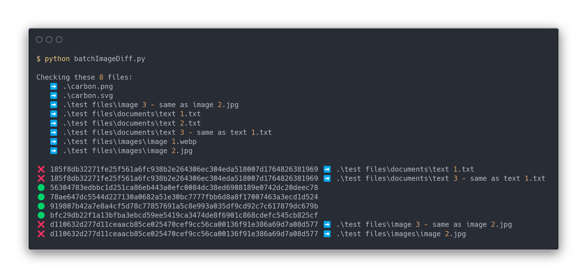

# docs/
*Website for my course material: [https://www.meneermaes.be/](https://www.meneermaes.be/)*

## Dependencies

Docker is the only dependency since all other dependencies are handles by Docker  
Install Docker: [https://docs.docker.com/engine/install/](https://docs.docker.com/engine/install/)  

## Launch
Launch the Docker container with the Jekyll project: `cd docs/ && bash init.sh`  

---

# maesbot/
*Tooling to make my life easier*

## maesbot/diff-file/ 

## maesbot/punten/
Automate everything that involves points, assignements, tests, ...
