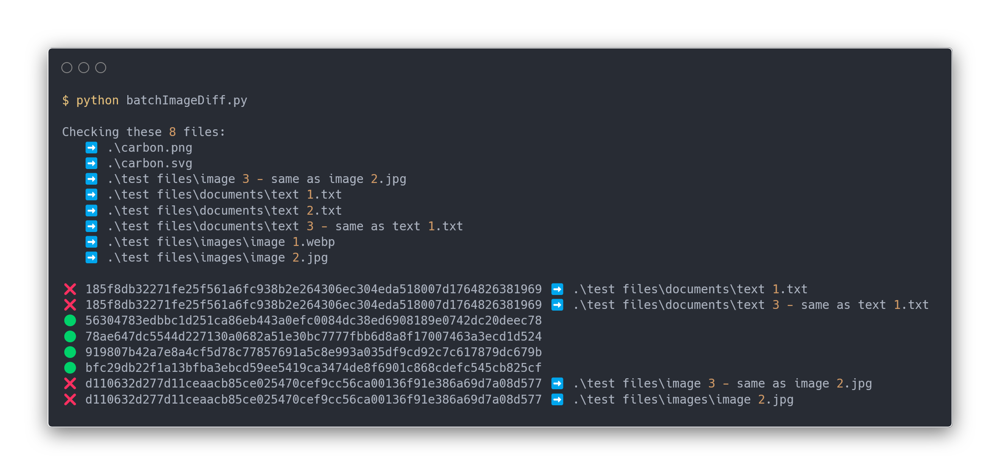

# Maesbot

`maesbot/`
*Tooling to make my life easier*

## maesbot/diff-file/ 


## maesbot/punten/
Automate everything that involves points, assignements, tests, ...

---

# MeneerMaes.be

`docs/`
*Website for my course material: [https://www.meneermaes.be/](https://www.meneermaes.be/)*

## Dependencies

Docker is the only dependency since all other dependencies are handles by Docker  
Install Docker: [https://docs.docker.com/engine/install/](https://docs.docker.com/engine/install/)  

## Launch
Launch the Docker container with the Jekyll project: `cd docs/ && bash init.sh`  

## Project structure
- `assets/`: Directory for storing static files like images, CSS, and JavaScript
- `CNAME`: File specifying custom domain for GitHub Pages
- `config.yml`: Main configuration file for the Jekyll site
- `content/`: The content of my website: markdown, images, ...
- `_data/`: Directory for storing data files (YAML, JSON, CSV) used in the site
- `Dockerfile`: Contains instructions for building a Docker image of the site
- `Gemfile`: Specifies Ruby gem dependencies for the project
- `Gemfile.lock`: Locks gem versions for consistent builds across different environments
- `_includes/`: Directory for reusable HTML snippets (e.g., headers, footers, navigation) that can be inserted into multiple pages or layouts
- `index.md`: Start page for the website
- `.Jekyll-cache/`: Directory storing cached files to speed up site generation
- `init.sh`: Script to launch the Jekyll website
- `_layouts/`: Directory containing template files for different page layouts
- `_site/`: Output directory where Jekyll generates the final static site aka the final .html files

## Libraries

### Highlight.js 

Imported in `_layouts/default.html`

**Every languages needs to be imported separately:**
1. Look for all codeblocks: `grep -RhoE '^[[:space:]]*```[[:alnum:]_+-]+' . --include='*.md' | sed -E 's/^[[:space:]]*```//' | sort -u`
  - Have aliasses is not a problem highlight.js accepts `js` as well as `javascript` and `bash` as well ass `sh`, ...
  - Of if you want to see in what file they are: `grep -RnoE '^[[:space:]]*```[[:alnum:]_+-]+' . --include='*.md'`
2. Go to `https://cdnjs.com/libraries/highlight.js/11.9.0`, check if the version is correct, filter on Javascript files 
3. Look for the correct langige file and add it to `_layouts/default.html`
4. Add styling in `assets/styles.scss`, seartch for `/* CODEBLOCKS */` in the file

**Find codeblocks with no language:**
1. Find all: `awk '/^[[:space:]]*```/ { if (!inside) { if ($0 ~ /^[[:space:]]*```[[:space:]]*$/) print FILENAME ":" FNR ":" $0; inside = 1 } else { inside = 0 } }' $(find . -name '*.md' -type f)`
2. Open vim on the correct line: `nvim ./flex/Bash-scripting.md +65`
