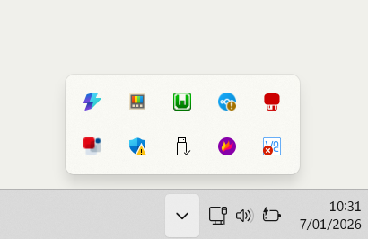

# WAMP 

## Installatie

1. Surf naar [https://github.com/abbodi1406/vcredist/releases](https://github.com/abbodi1406/vcredist/releases)
2. Download & installeer **VisualCppRedist_AIO_x86_x64.exe**
3. Surf naar [https://sourceforge.net/projects/wampserver/files/](https://sourceforge.net/projects/wampserver/files/)
4. Klik op **Download Latest Version**
5. Installeer het gedownloade bestand (**wampserver.exe**)

## Gebruik

1. Start Wampserver
2. Klik op het Wamp icoontje rechts onderaan in de **system tray**  
  {: width='30px' }  
  {: width='300px' }
3. Klik op **PhpMyAdmin > PhpMyAdmin**
4. Log in met
  - Gebruikernaam: **root**
  - **Geen wachtwoord**

# XAMPP

## Installatie

1. Surf naar [https://www.apachefriends.org/download.html](https://www.apachefriends.org/download.html)
1. Download & installeer **XAMPP**

## Gebruik

1. Apache > Start
2. MySQL > Start > Admin

**Bij error: MySQL shutdown unexcpectedly, ...**{: .badText }
1. Open task manager ctrl, shift, esc.
2. Alles met SQL sluiten.
