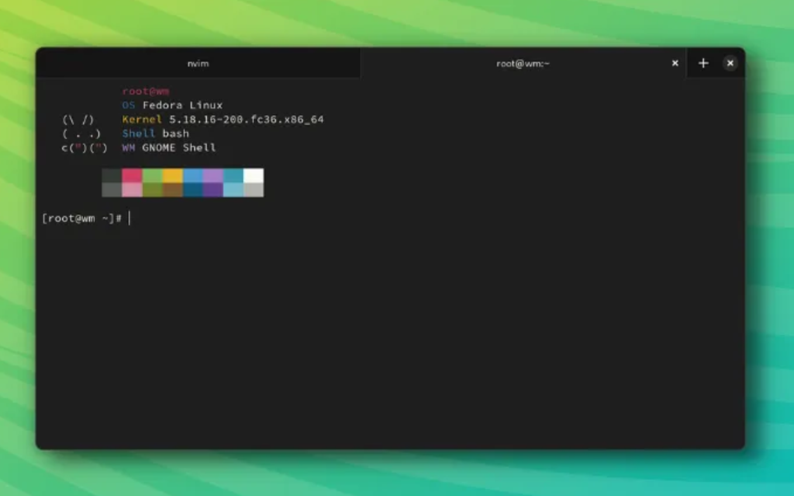
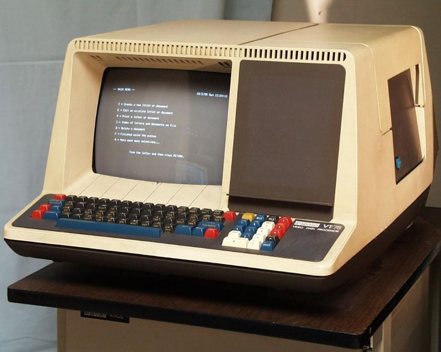
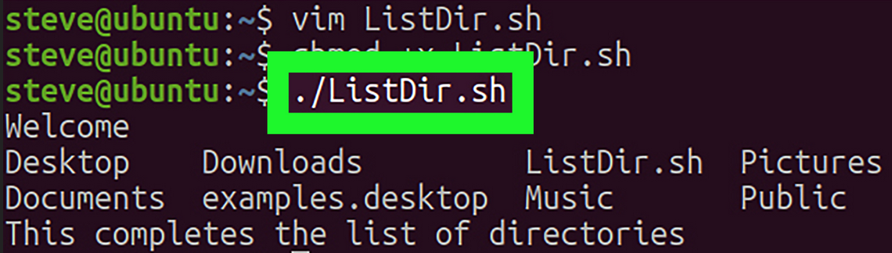
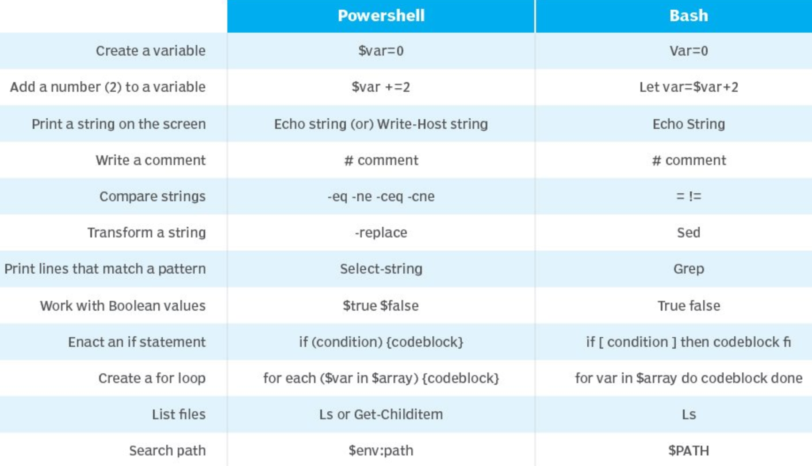

# Bash commands

## Navigatie

| Navigatie                            | Afkorting               | Functie                                         |
|--------------------------------------|-------------------------|-------------------------------------------------|
| `pwd`                                | Print working directory | De locatie waar we zitten                       |
| `ls`                                 | List                    | Lijst met inhoud van de folder waarin we zitten |
| `ls -a`                              | List all                | Lijst met **hidden files en folders**           |
| `ls -l`                              | List in long format     | Lijst met **info**                              |
| `ls -al`                             | List all in long format | Lijst met **info & hidden files**               |
| `tree .`   `tree folder/folder/`  |                         | Lijst in boomstructuur                          |
| `cd folder`   `cd folder/folder/` | Change directory        | Naar een andere locatie gaan                    |
| `cd ..`   `cd ../..`              | Change directory        | Een locatie **hoger** gaan                      |
| `cd - `                              | Change directory        | Naar de **vorige** locatie gaan                 |
| `cd`                                 | Change directory        | Naar de **startlocatie** gaan                   |

## Bestanden en folders beheren

| Aanmaken          | Afkoring         | Functie                                 |
|-------------------|------------------|-----------------------------------------|
| `touch`           |                  | **Bestand** aanmaken                    |
| `mkdir`           | Make directory   | **Folder** aanmaken                     |
| `rm`              | Remove           | **Bestand** verwijderen                 |
| `rm -r`           | Remove recursive | **Folder** verwijderen                  |
| `cp file1 file2`  | Copy             | **Bestanden** kopiëren                  |
| `cp -r dir1 dir2` | Copy recursive   | **Folder** kopiëren                     |
| `mv file1 file2`  | Move             | **Bestanden** verplaatsen/**hernoemen** |
| `mv -r dir1 dir2` | Move recursive   | **Folder** verplaatsen/**hernoemen**    |
| `cat file`        | Concatenate      | Inhoud van een (tekst)file bekijken     |

## Coderen

| Coderen             | Afkoring | Functie                                            |
|---------------------|----------|----------------------------------------------------|
| `code bestand`      |          | Bestand openen in **VS Code**                      |
| `codium bestand`    |          | Bestand openen in **VS Codium**                    |
| `thonny bestand`    |          | Bestand openen in de **Raspberry Pi Code Editor**  |
| `nano bestand`      |          | Bestand openen in de **Nano Terminal Code Editor** |
| `python bestand.py` |          | Python code uitvoeren                              |

# Command line shortcuts

&#58; **Stop** het command dat aan het runnen is/**verwijder** het command dat je aan het typen bent.
&#58; Ga naar het **begin** van de lijn.
&#58; Ga naar het **einde** van de lijn.
&#58; **Copy**.
&#58; **Paste**.

`command 1 && command 2 && command 3`: Commands **chainen** *(na elkaar uitvoeren)*.

# Terminologie










