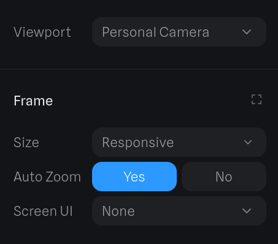
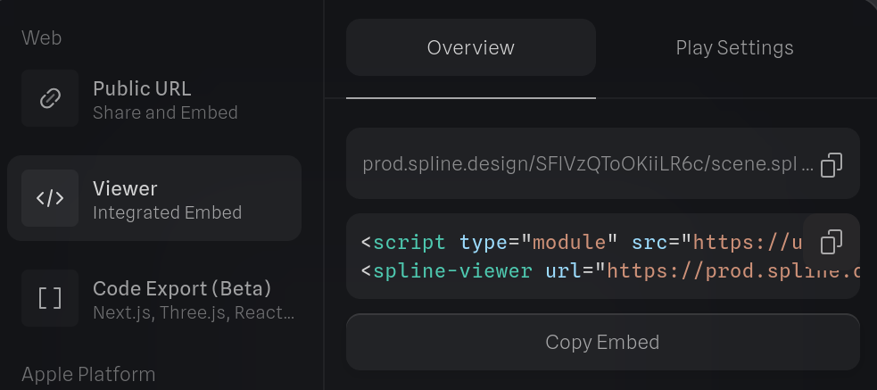

> Dynasmische & interactieve 3D web graphics

[Spline.design](https://spline.design/) is jouw geheime wapen voor 3D-webdesign! Vergeet die eindeloze code en dat gedoe van vroeger. Wat ooit tijdrovend en lastig was, is nu sneller dan ooit. Spline regelt het voor je!

Duik in de [Spline showcase](https://spline.design/examples) en laat je ogen branden van de epische creaties die daar op je wachten! En ja, **jij kan dit ook!**  
Let's GOOOOOO!

# Tijd om te experimenteren

Open spline, experimenteer, en probeer in **40min** tijd een **afgewerkt project** te maken.

# Opdracht 1: Showcase & tutorial



Kies **1 features van Spline**:

- 3D modeling
- 3D sculpting
- 3D paths
- UI (user interface) scenes
- Animaties
- Interacties/events
- Physics
- Particles
- Materials, scene & lights
- Cartoon style
- Importing & exporting
- ...

## Stappenplan

1. Experimenteer, bekijk de [officiële documentatie](https://docs.spline.design/doc/-getting-started/doc390iSGamE).
2. Maak een **showcase project**.
3. Maak een **tutorial website met stappenplan** waarom je uitlegt hoe je onderwerp werkt of hoe je het showcase project gemaakt hebt.
   Zorg ervoor dat je tutorial **duidelijk** en **overzichtelijk** is, je klasgenoten zullen hem gebruiken.

## Uitdaging

- Zoek een manier om een interactie te krijgen met de muis op heel de pagina.

# Tutorials testen

Nu is het tijd om elkaars tutorials uit te testen en **constructieve feedback** te geven.
Wissel je tutorial uit met een klasgenoot en voer hem stap voor stap uit.

**Richt vragen om feedback te formuleren:**

- Zijn de instructies duidelijk en volledig?
- Werkt alles zoals beschreven?
- Zijn er stappen die extra uitleg nodig hebben?
- Kom je ergens vast te zitten?
- Wat vind je goed aan de tutorial?
- Welke suggesties heb je ter verbetering?

**Tips voor het geven van feedback:**

- Wees specifiek in je opmerkingen
- Begin met positieve punten
- Formuleer verbeter punten constructief
- Geef concrete voorbeelden
- Blijf respectvol en behulpzaam

Schrijf je feedback neer, upload het document in de uploadzone en deel het met je klasgenoot.  
Vergeet niet in je document te vermelden welke tutorial je beoordeelde.

# Feedback verwerken

Nu je feedback hebt ontvangen van je klasgenoot, is het tijd om deze te verwerken en je **tutorial** te **verbeteren**.
Feedback is een waardevol hulpmiddel om je werk te verfijnen en te leren van de ervaringen van anderen.

1. **Feedback analyseren:**  
   Alvorens aanpassingen te beginnen maken neem je eerst zorgvuldig de **volledige** feedback door.
2. **Beslissingen nemen:**  
   Niet alle feedback hoeft tot een directe aanpassing te leiden.  
   Beslis welke suggesties je implementeert en welke je achterwege laat. Zorg ervoor dat elke aanpassing bijdraagt aan het **oorspronkelijke doel** van je tutorial.  
   Soms kan het nuttig zijn om met de persoon die de feedback gaf in gesprek te gaan om meer duidelijkheid te krijgen over een opmerking.
3. **Aanpassingen doorvoeren:**  
   Nu je hebt besloten welke feedback je gaat verwerken, is het tijd om je **tutorial te herzien en aan te passen**.
   Overweeg **visuele aanpassingen** om je tutorial aantrekkelijker te maken, zoals het toevoegen van screenshots, diagrammen of video's.
4. **Reflectie:**  
   Bekijk na het doorvoeren van de wijzigingen je aangepaste tutorial nogmaals en voer indien mogelijk een laatste test uit.  
   **Stel jezelf de volgende vragen:**
   - Zijn de instructies nu duidelijker?
   - Zijn de problemen die in de feedback werden genoemd opgelost?
   - Wat heb je geleerd uit het feedbackproces?

Upload je definitieve versie van de tutorial in de uploadzone.

# Showcase

De volgende stap is om je project te presenteren aan je klasgenoten.
Dit is je kans om te laten zien waar je de afgelopen lessen aan hebt gewerkt en om je technische vaardigheden te demonstreren.

Presenteer je showcase project aan de klas en leg **kort en krachtig** uit wat je feature is en wat je er **praktisch** allemaal mee kan doen.
**Concrete voorbeelden** kunnen hier bij helpen.

**Tips om je showcase voor te brengen:**

- Spreek rustig en duidelijk
- Maak oogcontact met je publiek
- Wees enthousiast over je werk

# Opdracht: Website voor de richting

Met jouw Spline-project ga je een vak binnen onze IT-richting op een indrukwekkende manier in de kijker zetten.  
Het eindresultaat wordt onderdeel van een gezamenlijke website die we als klas presenteren.

Kies een richtingspecifiek vak _(webtechnology, databases, software development, ...)_ en maak een 3D web ervaring die bezoekers aantrekt en informeert.

**Gebruik de tutorials die jullie gemaakt hebben. Deze kan je downloaden uit de uploadzone**.

## Eisen van je project

We combineren alle projecten tot één interactieve website. Jouw taak is om een creatieve bijdrage te leveren die voldoet aan onderstaande criteria:

- **Titel van het vak**  
   De naam van het vak dat je gekozen hebt moet prominent zichtbaar zijn in je ontwerp.
- **Ondertitel**  
  Een korte ondertitel zoals het vak kort uitgelegd, wat je in het vak leert of waarom het belangrijk is.
- **Animatie**  
   Voeg minstens één animatie toe.  
   _Bijvoorbeeld een bewegend object, een roterende camera, of een dynamisch licht._
- **Interactief element**  
   Minstens één element moet interactief zijn.  
   _Bijvoorbeeld: een knop, een object dat je kunt verslepen, of een hover-effect._  
   Zorg dat het duidelijk is welk element interactief is.  
   _Bijvoorbeeld door gebruik van kleur of een oplichtend effect._
- **Frame settings**  
   Zorg dat je project deze frame settings heeft:  
  {: .frame }{: width='300px' }

## Ideeën

**Bezoek de galerij op [spline.design](https://spline.design/examples) voor ideeën en voorbeelden.**

Weet je niet waar te beginnen?  
Laat je inspireren door de volgende ideeën, maar probeer er jouw eigen creatieve draai aan te geven.

- **Webtechnology**  
  Maak een 3D-weergave van een browservenster met knoppen en een adresbalk.  
  Voeg interactieve knoppen toe die reageren op klikken of hover.  
  Gebruik animaties zoals een openende laptop of een oplichtend tabblad.
- **Software Development**  
  Creëer een 3D-visualisatie van een code-editor met bewegende code-strings.  
  Voeg een interactief toetsenbord toe dat reageert op klikken.  
  Maak een animatie waarin de code wordt "uitgevoerd" en iets verschijnt _(bijvoorbeeld een game of een programma)_.
- **Hardware**  
  Bouw een interactieve computerchip of een 3D-model van een moederbord.  
  Voeg animaties toe, zoals vonken of stroom die door kabels loopt.  
  Maak een knop waarmee je een onderdeel kunt open- of dichtklappen.
- **Databases**  
  Creëer een 3D-weergave van een datacenter, met servers die oplichten.  
  Animeer "gegevenslijnen" die tussen servers bewegen.

## Tips

- **Testen**  
   Controleer regelmatig je project op verschillende schermen.
- **Feedback**  
   Vraag feedback aan klasgenoten om je ontwerp te verbeteren.
- **Diepte en compositie**  
   Creëer een boeiende 3D-opstelling door objecten op verschillende afstanden te plaatsen.
- **Gebruik van kleur en licht**  
   Experimenteer met kleuren en lichtbronnen om je project een professionele uitstraling te geven. Kies kleuren die passen bij het thema van je vak en gebruik belichting om bepaalde elementen te benadrukken.
- **Toelichting**  
   Voeg een korte, duidelijke tekst of een visueel element toe dat uitlegt waarom jouw vak essentieel is in de IT-sector. Denk bijvoorbeeld aan een slagzin of een korte uitleg die meteen de aandacht trekt.

## Uploaden

Upload een **Word-document** met daarin de **embed code** van je project.  
Druk op  om de embed code te kopiëren.

{: .frame }{: width='600px' }

## Doelen & puntenverdeling




# Samenvoegen tot een complete website

Nu iedereen een eigen project heeft gemaakt, is het tijd om **alles samen te voegen tot één grote interactieve website**. Dit vereist samenwerking, structurering en publicatie.

- Jullie beslissen samen welke **volgorde** de projecten krijgen op de website.
- Voorzie een passende **title & favicon**.
- Gebruik **Git** om efficiënt samen te werken.
- Publiceer de afgewerkte website op **GitHub Pages**.


