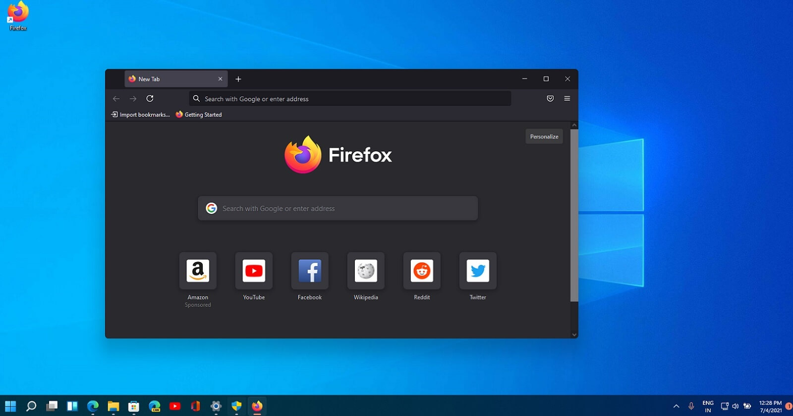
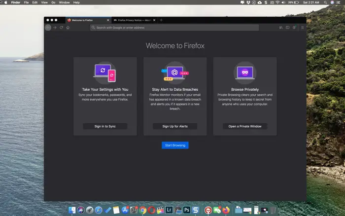

# Hardware & software



# Besturingssysteem

{% include toggle.html title="Wat is het besturingssysteem?" content="
Een **besturingssysteem (OS of operating system)** fungeert als een brug tussen de hardware en de software.  
Het zorgt ervoor dat de programma's de hardware van een computer kunnen gebruiken.

De bekenste besturingssytemen voor computers zijn **Windows & MacOS**.  
De bekenste besturingssytemen voor smartphones zijn **Android & IOS**.

{: width='700px' .frame }

{: width='700px' .frame }

**Functies van het besturingssysteem:**
- **Beheer van hardware:** Het besturingssysteem zorgt ervoor dat de verschillende hardwarecomponenten, zoals de processor, het geheugen, en opslag, efficiënt en correct worden gebruikt.
- **Procesbeheer:** Het besturingssysteem beheert de processen (taken) die op de computer draaien. Het houdt bij welke programma’s actief zijn en verdeelt de beschikbare bronnen, zoals rekenkracht en geheugen, over deze processen. Dit omvat ook multitasking, waarbij meerdere programma's tegelijkertijd kunnen draaien.
- **Apparaatbeheer:** Het OS zorgt ervoor dat alle aangesloten apparaten (zoals printers, toetsenborden, muizen en grafische kaarten) goed werken en communiceert met de benodigde stuurprogramma's (drivers) om deze apparaten aan te sturen.
- **Beveiliging en gebruikersbeheer:** Het besturingssysteem beschermt de computer door gebruikersrechten te beheren. Het kan bijvoorbeeld verschillende gebruikersaccounts hebben, elk met hun eigen toegangsrechten, zodat niet iedereen bij alle bestanden en instellingen kan.
- **Interface voor de gebruiker:** Een belangrijk onderdeel van een OS is de gebruikersinterface, waarmee je via een grafische omgeving de computer kunt bedienen.
" %}

{% include toggle.html title="Kan je voorbeelden geven wat een besturingssysteem doet?" content="
**Printen**
1. Je klikt in Word op afdrukken.
2. Word stuurt de afdrukopdracht naar het besturingssysteem.
3. Het besturingssysteem communiceert met de printer (via de printerdriver) en zorgt ervoor dat de printer de juiste informatie krijgt om het document af te drukken.

**Applicaties openen**
1. Je start Microsoft Word.
2. Het besturingssysteem reserveert een deel van de rekenkracht van de CPU.
3. Als je daarna een webbrowser opent, zorgt het besturingssysteem ervoor dat de browser ook een deel van de rekenkracht krijgt, zodat ze beiden samen kunnen draaien.

**Bestanden opslaan**
1. Je slaat een bewerkte foto op in Photoshop.
2. Het programma stuurt de opslagopdracht naar het besturingssysteem.
3. Het besturingssysteem schrijft de data naar de harde schijf en zorgt ervoor dat de foto op de juiste plek en in het juiste formaat wordt opgeslagen.

**Programma's beheren**
1.
" %}


