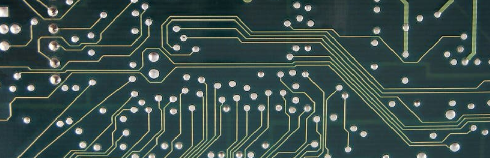

{% include toggle.html title="Wat is gegevenstransport?" content="
> Het verplaatsen van informatie van A naar B.

Stel je voor dat je een WhatsApp-bericht naar je vriend stuurt. Dat bericht moet van jouw telefoon naar de telefoon van je vriend reizen. Het kan via wifi of 4G, soms gaat het via verschillende servers en routers, en uiteindelijk komt het aan. Als één stap niet goed verloopt, komt het bericht verkeerd aan of helemaal niet. Computers doen hetzelfde, maar dan duizenden keren per seconde.

**Kan je een voorbeeld geven uit je iegen app-wereld waar data snel of foutloos moet aankomen, en wat er fout loopt als dit niet gebeurt?**
" %}

# Het versturen van data

## Bits

Een bit is de kleinste eenheid van digitale informatie: een 0 of een 1.  
Alles op een computer *(tekst, foto, video, geluid)* wordt uiteindelijk vertaald naar reeksen van bits.

## Pakket

Een stukje van een groter bestand, zoals een video die in stukjes wordt verstuurd.  
Een pakket is een **verzameling bits** die samen een klein deel van een bestand of bericht vormen. Computers **splitsen grote bestanden op** in pakketten zodat ze sneller en betrouwbaarder kunnen worden verzonden.

## Header

De header van een datapakket bevat **belangrijke informatie over het pakket**:
- Waar het naartoe moet (IP-adres, poortnummer)
- Volgorde van het pakket (zodat de ontvanger ze correct kan samenvoegen)
- Eventueel type data of instructies voor foutcontrole

Zoals het adres op een envelop, zo weet de postbode waar hij het heen moet brengen.

## Payload

De **eigenlijke data** die het pakketje vervoert.  
Dit kan een stukje van een video zijn, een fragment van een bestand, of een stukje tekst in een chat.

## Overzicht

| Term    | Betekenis                                         |
| ------- | ------------------------------------------------- |
| Bit     | Kleinste eenheid digitale info: 0 of 1            |
| Pakket  | Verzameling bits, deel van een bestand            |
| Header  | Informatie over bestemming, volgorde en type data |
| Payload | De eigenlijke data die het pakket vervoert        |

# Systeembus

Alles wat je doet op een computer of laptop gaat via "digitale snelwegen": **de bus van het moederbord**. Stel je voor dat je laptop een mini-stad is, met wegen, verkeerslichten en voertuigen.

**Waar zitten ze?**  
De bussen zitten ingebakken in het moederbord zelf.  
Ze verbinden bijvoorbeeld:
- CPU ↔ RAM (meestal via de front-side bus of moderne DMI/PCIe lanes)
- CPU ↔ uitbreidingskaarten (via PCIe-bussen)
- CPU ↔ opslagapparaten (via SATA of NVMe PCIe lanes)

In moderne moederborden zijn het dunne kopersporen op het PCB (de groene printplaat).

## De verschillende bussen

- Data-bus:
  De snelweg waar bits over rijden (de eigenlijke info).
- Adres-bus: 
  Verkeersborden die aangeven naar welk huis (geheugenadres) een bit moet.
- Control-bus:
  Verkeerslichten en verkeersregels, bijvoorbeeld: “CPU, stop met lezen, RAM mag nu schrijven”.

Voorbeeld:  
Je speelt een nummer op je computer of gsm. De CPU vraagt RAM om het bestand tijdelijk te bewaren. Bits reizen van opslag → RAM → CPU.

## Serieel vs parallel transport

Bits kunnen op verschillende manieren over de bus reizen:

- **Serieel transport:** 1 bit tegelijk, zoals een smalle weg waar auto’s één voor één over moeten.  
  Voordeel: betrouwbaar, minder kans op botsingen.  
  Voorbeeld: USB-stick of Wi-Fi. Bits reizen een voor een van of naar de computer.
- **Parallel transport:** meerdere bits tegelijk, zoals een brede snelweg met meerdere rijstroken.  
  Voordeel: sneller.  
  Nadeel: als de weg te lang of te smal is, kunnen auto’s botsen.  
  Voorbeeld: de data-bus van het moederbord, die RAM en CPU snel laat communiceren.
