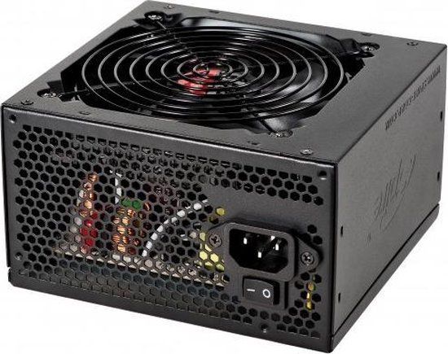
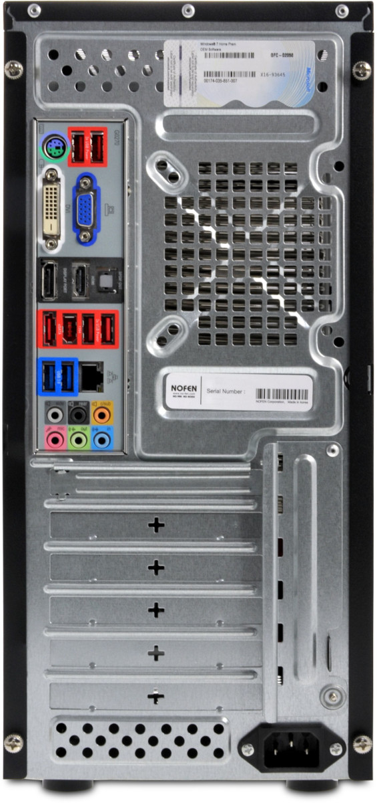
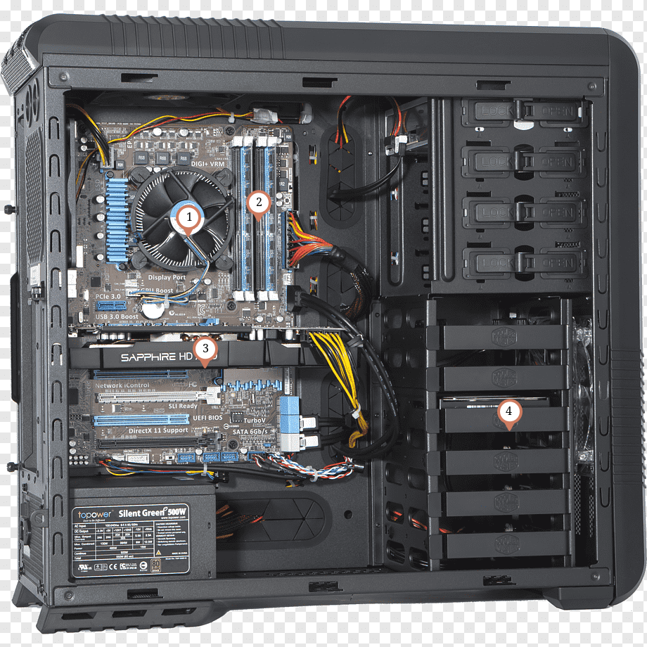
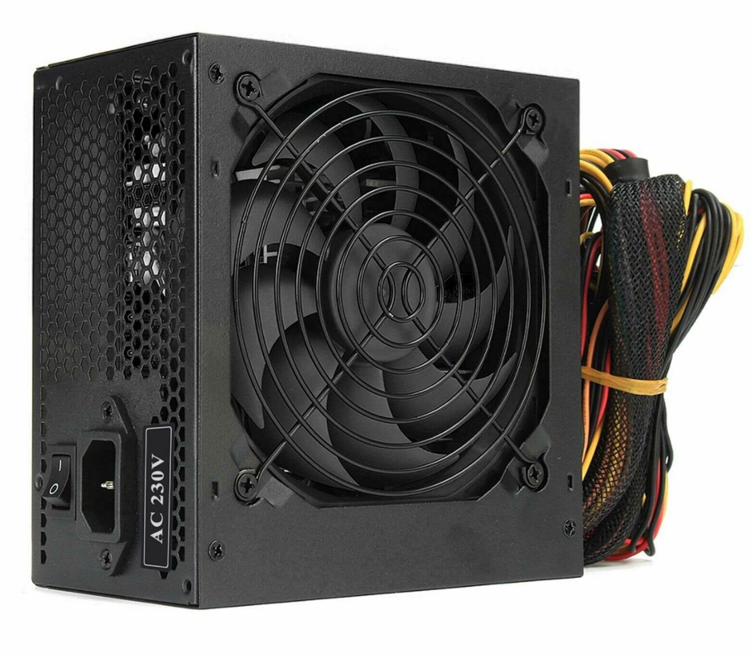
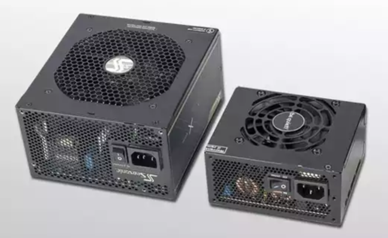
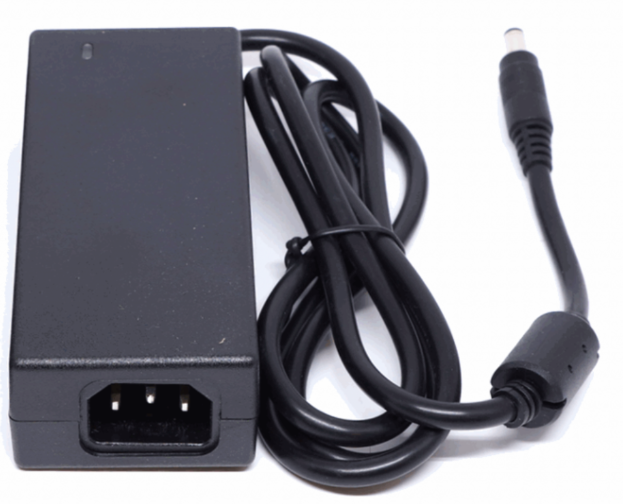
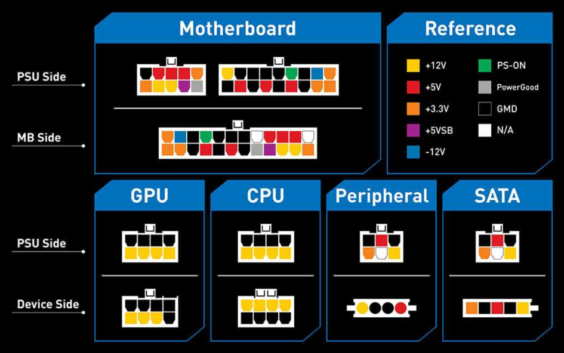

> Wordt vaak ook de **PSU of Power Supply Unit** genoemd.



{% include toggle.html title="Waarom kan je een computer niet gewoon rechtstreeks in het stopcontact steken?" content="
Een stopcontact levert **wisselstroom (AC)**.  
Computeronderdelen zijn gemaakt om te werken met lage **gelijkstroom (DC)**.  

Als je een computer rechtstreeks op het stopcontact zou aansluiten:
- Krijgen onderdelen veel te veel spanning
- Zou de stroom voortdurend van richting veranderen
- Zouden componenten beschadigd raken of doorbranden

Daarom gebruikt een computer een voeding (PSU) die:
- De stroom omzet
- De spanning verlaagt
- De stroom veilig verdeelt
" %}

# Spanning & vermogen

{% include toggle.html title="Wat zijn wissel- en gelijkstroom?" content="
**Gelijkstroom (DC)**  
Bij gelijkstroom stroomt elektriciteit altijd in **dezelfde richting**.  
Dat is **stabieler en veiliger** voor elektronische onderdelen.  

**Wisselstroom (AC)**  
Bij wisselstroom **verandert de richting** van de stroom voortdurend.  
Dit is de soort stroom uit het **stopcontact**.  
In Europa verandert die richting 50 keer per seconde.  
Wisselstroom veel praktischer voor:
- Elektriciteit over lange afstanden vervoeren
- Hele steden van stroom voorzien

Wanneer elektriciteit door kabels reist gaat een deel verloren als warmte.  
Bij lange afstanden wil je dus zo weinig mogelijk stroomverlies.
" %}

<iframe width="560" height="315" src="https://www.youtube.com/embed/SR3IR8OaNBg?si=sng9loEDrMFpHRuK" title="YouTube video player" frameborder="0" allow="accelerometer; autoplay; clipboard-write; encrypted-media; gyroscope; picture-in-picture; web-share" referrerpolicy="strict-origin-when-cross-origin" allowfullscreen></iframe>

{% include toggle.html title="Wat zijn spanning en vermogen?" content="
**Spanning (Volt)**  
Spanning geeft aan hoe sterk elektriciteit **duwt**.  
Je kan dit vergelijken met waterdruk in een waterleiding.  
Hoe hoger de spanning hoe krachtiger de elektrische stroom kan bewegen.

**Vermogen (Watt)**  
Vermogen geeft aan hoeveel energie een toestel **gebruikt of levert**.  
Je kan dit vergelijken met hoeveel water per seconde door een waterleiding stroomt.  

**Vergelijking:**
- Spanning (Volt) is de waterdruk.
- Vermogen (Watt) is hoeveel water er effectief beweegt.

**Een hoge spanning betekent niet automatisch hoog vermogen.**  
Vergelijk de spanning en het vermogen van deze vergelijkingen:
- Een dun straaltje water onder hoge druk: *spanning en vermogen?*
- Een grote waterstroom: *spanning en vermogen?*
" %}



## Opdracht: Gelijk- en wisselspanning

Download en maak deze oefening: [Gelijk- en wisselspanning](zelfstandige-opdrachten/gelijkspanning-en-wisselspanning.docx){: .opdracht }

## Opdracht: Spanningen in een computer

1. Hoeveel spanning gebruiken deze componenten?  
  
2. *Onderzoeksvraag:* Waarom zou een videokaart meer stroom nodig hebben dan een USB-stick?
3. Wat is het vermogen van deze toestellen?
  3.1 LED-lamp
  3.2 Laptop 
  3.3 Gaming PC

# PSU efficiëntie



{% include toggle.html title="Waarom hechten datacenters veel belang aan efficiente voedingen?" content="
Datacenters bevatten **duizenden** computers en servers.  
Zelfs kleine energieverliezen worden daardoor enorm groot.

Efficiënte voedingen zijn belangrijk omdat ze:
- Minder elektriciteit verspillen
- Minder warmte produceren
- Lagere elektriciteitskosten geven
- Minder zware koeling nodig hebben
- Beter zijn voor het milieu

Minder warmte betekent ook:
- Minder airconditioning
- Minder risico op oververhitting
- Betrouwbaardere servers
" %}

## Certificaten

{% include toggle.html title="Wat betekent 80 PLUS op een voeding?" content="
80 PLUS is een **certificering voor de efficiëntie** van een voeding.

Een voeding met 80 PLUS:
- Zet minstens **80%** van de energie om in **bruikbare stroom**
- Maximaal **20%** gaat verloren als **warmte**
" %}

{% include toggle.html title="Bestaan er 60 PLUS of 70 PLUS voedingen?" content="
**Nee**. De officiële certificering begint bij 80 PLUS.

Daarna komen:
- Bronze
- Silver
- Gold
- Platinum
- Titanium

Waarom geen 60 PLUS of 70 PLUS?
- 80% efficiëntie vroeger een praktische minimumstandaard werd
- Onder 80% wordt beschouwd als te inefficiënt voor moderne PC's
- De organisatie (CLEAResult / 80 PLUS programma) heeft nooit lagere tiers toegevoegd

Een voeding zonder certificaat kan dus 60%, 70% of 75% efficiënt zijn maar die mag zich gewoon geen **80 PLUS** noemen.
- 80 PLUS: start van certificering
- Alles daaronder: geen certificaat
" %}

{% include toggle.html title="Kiezen tussen bronze, silver, gold ... wat is het verschil echt?" content="
De 80 PLUS certificaten zeggen niet hoeveel vermogen een voeding levert, maar **hoe efficiënt ze energie omzet**.

Een voeding haalt stroom uit het stopcontact (AC) en zet die om naar DC.  
Niet alles wordt nuttige stroom, een deel gaat verloren als **warmte**.

**Voorbeelden bij een PC die `500W` nodig heeft:**

- 80 PLUS **Bronze** (~82% efficiënt)
  - Uit stopcontact: ~`610W`
  - Verlies: ~`110W` warmte

- 80 PLUS **Gold** (~90% efficiënt)
  - Uit stopcontact: ~`555W`
  - Verlies: ~`55W` warmte

- 80 PLUS **Platinum** (~92–94%)
  - Uit stopcontact: ~`535W`
  - Verlies: ~`35`–`45W` warmte

**Bronze**
- Goedkoper
- Meer warmte
- Iets hoger verbruik

**Gold**
- Beste balans
- Standaard voor gaming PC's
- Minder warmte, stiller

**Platinum & Titanium**
- Zeer efficiënt
- Minder koeling nodig
- **Vaak in servers of high-end systemen**

> Efficiëntie verandert NIET hoeveel je PC kan gebruiken, WEL hoeveel energie je uit het stopcontact trekt
" %}

# Soorten voedingen 

## ATX voeding (standaard PC voeding)



## SFX voeding (kleine PC's)



## Laptop voedingen (extern)



# Hoe kies je een voeding 

{% include toggle.html title="Stap 1: Hoeveel vermogen heb je nodig?" content="
Een voeding moet genoeg vermogen leveren voor **alle onderdelen samen**.  
In de praktijk verbruiken onderdelen niet altijd maximaal tegelijk, maar je moet er wel vanuit gaan dat dit kan gebeuren.

Typisch verbruik per onderdeel:
- **CPU (processor)**  
  `65W tot 150W`  
  Krachtige CPU's (gaming/rendering) verbruiken meer
- **GPU (videokaart)**  
  `100W tot 400W+`  
  Dit is meestal het grootste verbruik in een PC
- **Moederbord + RAM + opslag**  
  `30W tot 80W`  
  Relatief stabiel en laag verbruik
- **Andere (fans, USB, RGB, etc.)**  
  `10W tot 30W` extra

**Veiligheidsmargage**  
Tel alles samen en voeg 20–30% marge toe.

Waarom?
- Componenten kunnen pieken (kortstondig meer verbruik)
- Voeding werkt efficiënter rond 50–70% belasting
- Je voorkomt dat de voeding constant op maximum draait
" %}



{% include toggle.html title="Stap 3: Aansluitingen controleren" content="
Een voeding is niet alleen een kwestie van genoeg Watt hebben.  
Je moet ook genoeg **juiste kabels en aansluitingen** hebben voor je onderdelen.

Dit zijn de belangrijkste kabels: 
- PCIe kabels voor GPU
- SATA kabels voor SSD/HDD
- CPU power (8-pin of 4+4 pin)

Niet alle kabels van een voeding gaan naar dezelfde plaats.  
Sommige kabels gaan **eerst naar het moederbord**, andere gaan **rechtstreeks naar onderdelen**.
- De CPU krijgt zijn stroom via een aansluiting op het moederbord
- PCIe kabel (GPU): krachtige videokaarten hebben vaak extra stroom nodig. Die kabel gaat meestal rechtstreeks naar de videokaart.
- SATA power (voor SSD's, HDD's, RGB controllers, fan hubs, ...). Deze kabel gaat rechtstreeks naar het apparaat.
- RAM gaat via het moederbord

**Veelgemaakte beginnersfouten:**
- Denken dat alle voedingen dezelfde kabels hebben
- Vergeten GPU kabels te tellen
- Niet checken hoeveel SSD's/HDD's je hebt
" %}

##  Oefening: Kies een voeding 

Je bouwt een PC met:
- Ryzen 5 CPU `95W`
- RTX 4070 `200W`
- 2 SSD's
- 1 moederbord + RAM

Vragen:
- Schat totaal verbruik
- Welke voeding (Watt) kies je?
- Welke efficiëntie (Bronze/Gold/Platinum)?
- Waarom is `500W` hier waarschijnlijk te weinig?

# Veiligheid 





## Quiz

> Waar of niet waar?



{% include toggle.html title="Een voeding is veilig zodra de PC uit staat" content="
> Niet waar

Een PC uitschakelen betekent niet dat de voeding volledig &quot;leeg&quot; of veilig is.

Wat gebeurt er echt?
- De PC staat uit, maar de voeding blijft verbonden met `230V` stopcontact
- Binnenin de PSU zitten condensatoren, die kunnen nog kort energie opslaan

Gevolg:
- Je kan nog steeds een elektrische schok krijgen
- Daarom is &quot;uit&quot; niet hetzelfde als &quot;veilig&quot;

**Altijd de stekker uit het stopcontact halen voor je aan een voeding werkt**
" %}




