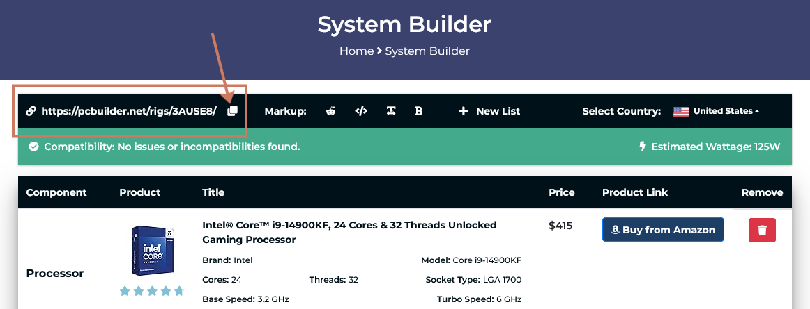
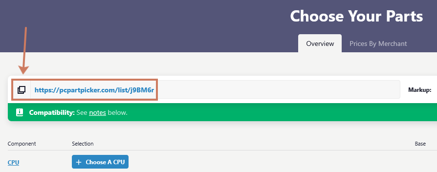

**Niet iedereen heeft dezelfde noden als het gaat om een computer.**  
In deze opdracht krijg je een scenario waarin je een computer moet samenstellen op basis van de behoeften van een specifieke persoon.
Je krijgt een budget en moet onderzoeken welke onderdelen belangrijk zijn voor jouw scenario.  
Daarna stel je een PC samen en motiveer je jouw keuzes.

# Scenario's

1. **Leerling uit het eerste middelbaar**
2. **Student in het hoger onderwijs/universiteit**
3. **Pas afgestudeerde werkzoekende**
4. **Zelfstandige IT’er**
5. **Kleine zelfstandige** (bv. elektricien, garagist, fotograaf, videoeditor, architect, ...)
6. **Grafisch ontwerper**
7. **Hardcore gamer/streamer**

# Opdracht: Hardware Shopping

Je mag de opdracht uitwerken op één van de volgende manieren:

- **Geschreven document**  
   Maak een duidelijke structuur met titels, tabellen, een inhoudstafel, ...
- **Presentatie**  
   Zorg voor een duidelijk en grafisch interessante presentatie.

## Noden

1. Waarvoor zal de PC het meest gebruikt worden.
2. Naar welke onderdelen vertaalt zich dat, welke onderdelen zijn dus het belangrijkste.
3. Welke onderdelen zijn minder belangrijk.
4. Zijn er extra onderdelen, poorten of externe hardware die nuttig kunnen zijn?

## Besturingssysteem

- Welk Besturingssysteem leent zich het beste bij dit scenario, en waarom?
- Waarom lenen de andere Besturingssystemen zich minder bij dit scenario.

## Koop de onderdelen

Stel voor beide budgetten een **volledige PC** samen en motiveer je keuzes.

- Laag budget: **max €1000**
- Hoog budget: **max €2500**

Voorzie alle onderdelen die een werkende PC nodig heeft:














Vergelijk kort de goedkopere en duurdere configuratie:

- Wat zijn de belangrijkste verschillen?
- Welke compromissen moest je maken binnen het lage budget?
- Wat krijg je extra bij het hogere budget?

### PC build tools

Via deze webtools kan je zelf een PC samenstellen:

- [PC Part Picker](https://pcpartpicker.com)
- [PC Builder](https://pcbuilder.net)

Beide tools bieden de mogelijkheid om je setup te **bewaren** via een **URL**.
**Zet de URL van je config mee in je verslag.**

{: .frame }
{: .frame }

## Puntenverdeling


