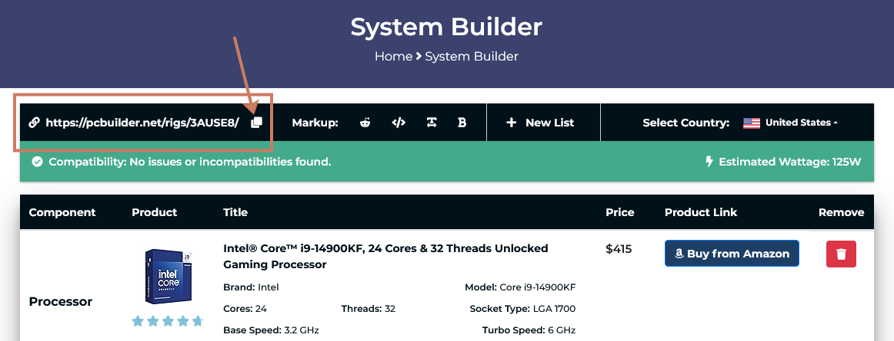
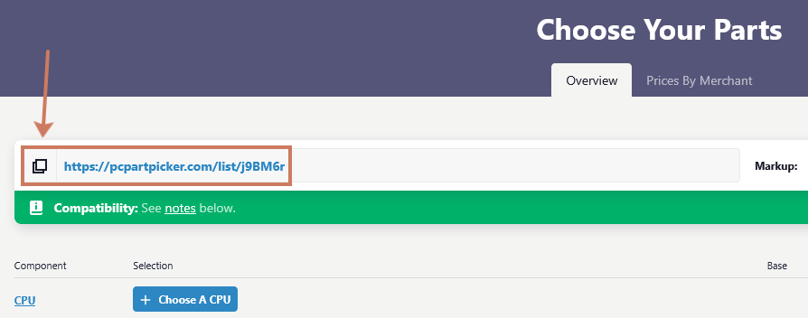

> Jij bent een **IT-consultant** en moeten een setup samenstellen voor een klant

**Niet iedereen heeft dezelfde noden als het gaat om een computer.**  
In deze opdracht krijg je een scenario waarin je een computer moet samenstellen op basis van de behoeften van een specifieke persoon.
Je krijgt een budget en moet onderzoeken welke onderdelen belangrijk zijn voor jouw scenario.  
Daarna stel je een PC samen en motiveer je jouw keuzes.

# Scenario's

1. **Leerling uit het eerste middelbaar**
2. **Student in het hoger onderwijs/universiteit**
3. **Pas afgestudeerde werkzoekende**
4. **Zelfstandige IT’er**
5. **Kleine zelfstandige** (bv. elektricien, garagist, fotograaf, videoeditor, architect, ...)
6. **Grafisch ontwerper**
7. **Hardcore gamer/streamer**

# Verslag

Je mag de opdracht uitwerken op één van de volgende manieren:

- **Geschreven document**  
   Maak een duidelijke structuur met titels, tabellen, een inhoudstafel, ...
- **Presentatie**  
   Zorg voor een duidelijk en grafisch interessante presentatie.

# Monderlinge Toelichting 

Voor deze opdracht is het belangrijk dat je niet enkel een correcte pc-samenstelling maakt, maar ook aantoont dat je begrijpt **waarom** je deze keuzes maakt.

Daarom zal je jouw voorstel mondeling toelichten alsof je in gesprek bent met de klant. Je legt in je eigen woorden uit welke onderdelen je gekozen hebt, hoe ze aansluiten bij de noden van de klant en waarom ze binnen het budget passen.

Je moet ook kunnen antwoorden op bijkomende vragen over je keuzes en eventueel alternatieven bespreken.

# Opdracht 1: Noden

## Noden

1. Waarvoor zal de PC het meest gebruikt worden.
2. Naar welke onderdelen vertaalt zich dat, welke **2 onderdelen** zijn dus het **belangrijkste**.
3. Welke **2 onderdelen** zijn minder **belangrijk**.
4. Zijn er **extra** onderdelen, poorten of externe hardware die nuttig kunnen zijn?

## Besturingssysteem

1. Welk **besturingssysteem** leent zich het beste bij dit scenario, en waarom?
2. Waarom lenen de andere besturingssystemen zich minder bij dit scenario.

## Voeding 

Zoek op en noteer in je document:
1. Wat gebeurt er bij te **zwakke voeding**?
2. Wat is **overkill**?

## Puntenverdeling



# Opdracht 2: Koop de onderdelen

Stel voor beide budgetten een **volledige PC** samen en motiveer je keuzes.

- Laag budget: **max €1000**
- Hoog budget: **max €2500**

Voorzie alle onderdelen die een werkende PC nodig heeft:














Vergelijk kort de goedkopere en duurdere configuratie:

- Wat zijn de belangrijkste verschillen?
- Welke compromissen moest je maken binnen het lage budget?
- Welke **2 dingen** zou je **niet** kunnen doen met jouw **goedkope setup**?
- Wat krijg je extra bij het hogere budget?

## PC build tools

Via deze webtools kan je zelf een PC samenstellen:

- [PC Part Picker](https://pcpartpicker.com)
- [PC Builder](https://pcbuilder.net)



Beide tools bieden de mogelijkheid om je setup te **bewaren** via een **URL**.
**Zet de URL van je config mee in je verslag.**

{: .frame }
{: .frame }

## Puntenverdeling



# Opdracht 3: Besparing & Backups

## Besparing 

De klant zegt last-minute: “**Je moet €200 besparen**”.
- Wat schrap je, bij beide builds?

## Backupstrategie

Stel je voor dat er iets misgaat met de laptop van je klant, bijvoorbeeld:
- de laptop crasht
- de laptop wordt gestolen
- de laptop wordt getroffen door ransomware

**Jij moet een betrouwbare backupstrategie uitwerken zodat de klant zo weinig mogelijk data verliest en snel weer kan werken.**

### 1. Wat is de 3-2-1 regel?
- Leg in je eigen woorden uit wat de 3-2-1 backupregel is  
- Is deze regel nodig voor jouw klant? Waarom wel of niet?

### 2. Jouw gekozen backupstrategie
- Beschrijf welke aanpak jij kiest *(cloud backup, externe harde schijf, combinatie, ...)*?
- Leg uit waarom jouw keuze goed past bij deze klant

### 3. Hardware en/of abonnementen
- Welke tools ga je gebruiken *(externe harde schijf, NAS, cloudopslag, ...)*?
- Welke abonnementen?
- Bereken ook:
   - De jaarlijkse kostprijs
   - Toon duidelijk hoe je aan dit bedrag komt

### 4. Wat, waar en hoe vaak back-uppen?
- Wat wordt geback-upt *(documenten, foto’s, volledige systeem, ...)*?
- Waar wordt welke data opgeslagen?
- Hoe vaak gebeurt de backup?

### 5. Automatisatie vs. gebruiker
- Hoe zorg je ervoor dat alles zo automatisch mogelijk verloopt?
- Wat moet de klant zelf nog doen *(schijf aansluiten, wachtwoorden onthouden, ...)*?

Doel: **zo weinig mogelijk kans op menselijke fouten**

### 6. Herstellen na een probleem
- Hoe zet je alles terug na een crash of aanval *(bestanden herstellen, eventueel volledige laptop opnieuw installeren, ...)*

## Puntenverdeling


