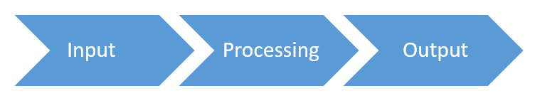

<iframe width="560" height="315" src="https://www.youtube.com/embed/DKGZlaPlVLY?si=mfSBDkaz3Ya0EiTC" title="YouTube video player" frameborder="0" allow="accelerometer; autoplay; clipboard-write; encrypted-media; gyroscope; picture-in-picture; web-share" referrerpolicy="strict-origin-when-cross-origin" allowfullscreen></iframe>

**Alle acties** die met behulp van of op **data** gebeuren, noemen we een **verwerking van de gegevens**.  
**Verwerken is het manipuleren (behandelen) van data**. 

De grote blokken binnen verwerking zijn:

{: .frame } 

- Het begrip **invoer** omvat alle handelingen die de gebruiker stelt om in te grijpen in het programma: het invoeren van gegevens, het klikken op knoppen, elementen in de interface slepen, enz.
- Van de **verwerking** zie je als gebruiker niets. Die speelt zich volledig af in de processor. Het berekenen van het resultaat en dit resultaat beschikbaar maken in het werkgeheugen zijn duidelijke voorbeelden van verwerking.
- De **uitvoer** tenslotte omhelst alle stappen in het computerprogramma die het mogelijk maken een resultaat te tonen. Dat gebeurt doorgaans via het beeldscherm, maar ook het afdrukken van een resultaat naar een printer kan uitvoer worden genoemd. Geluidssignalen die een programma produceert en naar de luidsprekers stuurt, vallen eveneens onder deze noemer.

# Oefening

[Download het bestand en los de oefeningen op](https://docs.google.com/document/d/1LRYSW51tOfXeQkyQeggYjAuAqSmgMR1t/edit?usp=sharing&ouid=114090905886704231803&rtpof=true&sd=true)
