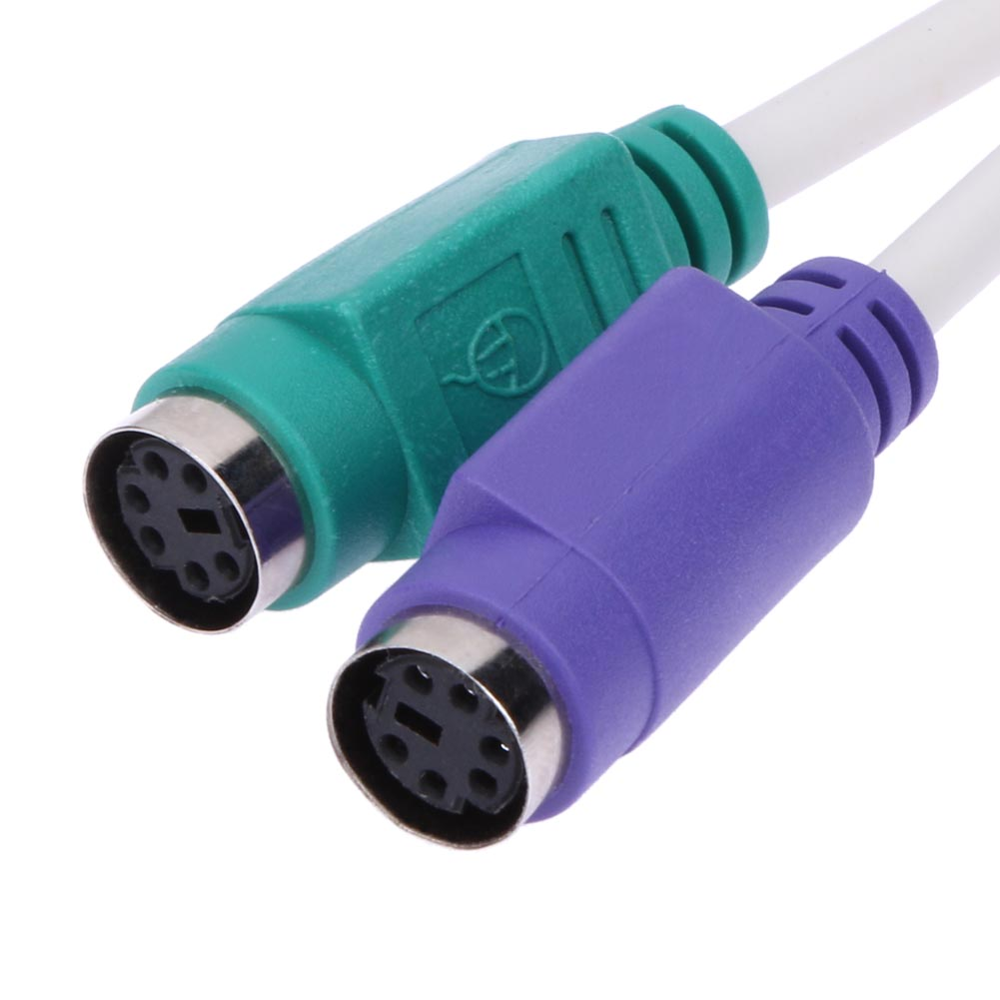

<iframe width="560" height="315" src="https://www.youtube.com/embed/yq9qzw8p7FI?si=CRwx-DLMMVM2zTew" title="YouTube video player" frameborder="0" allow="accelerometer; autoplay; clipboard-write; encrypted-media; gyroscope; picture-in-picture; web-share" referrerpolicy="strict-origin-when-cross-origin" allowfullscreen></iframe>

# Voorkant

{: height='600px' }









# Achterkant

{: height='600px' }

{% include toggle.html title="1" content="
**Audio In/Audio Out**  
Bijna elke computer heeft twee of meer audio-poorten waarop je verschillende apparaten kunt aansluiten, zoals luidsprekers, microfoons en headsets.
- **Roze**
    Deze poort is voor microfoons (invoer). Het is de poort waar je een microfoon kunt aansluiten om geluid naar de computer in te voeren, bijvoorbeeld voor spraakopname of videoconferenties.
- **Groen**
    Deze poort is voor luidsprekers of hoofdtelefoons (uitvoer). Het is meestal de poort die je gebruikt om geluid uit de computer naar je externe luidsprekers of hoofdtelefoon te sturen.
- **Blauw**
    Deze poort is voor line-in (invoer). Het wordt gebruikt voor het aansluiten van apparaten zoals een cd-speler, een externe geluidsbron of andere audiobronnen die je in de computer wilt invoeren.
" %}


{: .frame }


{: .frame }{: height='300px' }


{: .frame }{: height='300px' }


{: .frame }


{: .frame }{: height='300px' }



{: .frame }{: height='300px' }{: .wrap }
{: .frame }{: height='300px' }


{: .frame }{: height='300px' }
