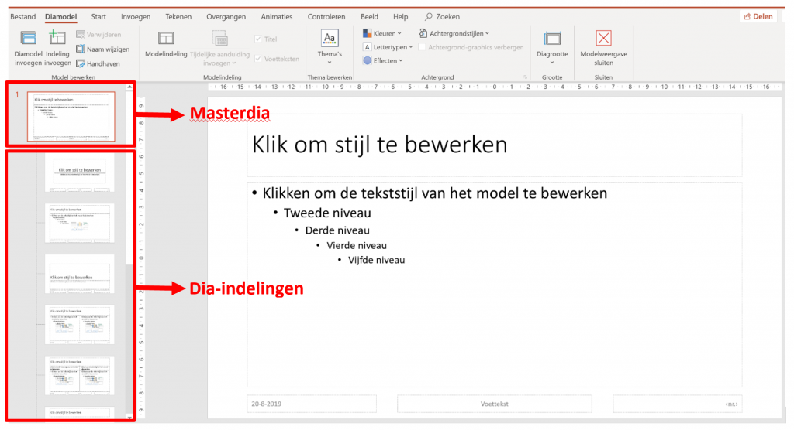

Stel dat je een presentatie hebt met een groot aantal dia’s. Je wenst het lettertype van de titel van elke dia aan te passen. Als je dit dia per dia gaat aanpassen, zal dit heel wat tijd in beslag nemen. Er is echter een andere manier van werken die heel wat efficiënter is, namelijk het werken met het diamodel.

<iframe width="560" height="315" src="https://www.youtube.com/embed/_BubhLvrla0?si=_HEnaa7oe_Gu36nM" title="YouTube video player" frameborder="0" allow="accelerometer; autoplay; clipboard-write; encrypted-media; gyroscope; picture-in-picture; web-share" referrerpolicy="strict-origin-when-cross-origin" allowfullscreen></iframe>

# Het diamodel aanpassen

Klik in het tabblad **Beeld** op de knop **Diamodel**.  
Je krijgt onderstaand overzicht te zien.  

In de zij balk aan de linkerzijde krijg je nu een ander overzicht te zien. Helemaal bovenaan vind je de **master dia** terug. Als je aanpassingen doet in deze dia, dan zullen de wijzigingen doorgevoerd worden op **alle dia’s**!

Onder de masterdia vind een overzicht terug van alle **dia-indelingen** die beschikbaar zijn in Microsoft PowerPoint.
- Wens je een aanpassing te doen in de **masterdia**? Selecteer de masterdia in de zijbalk en voer de aanpassingen door in de werkruimte.
- Wens je een aanpassing te doen voor een bepaalde **indeling**? Selecteer de gewenste indeling in de zijbalk en voer de aanpassingen door in de werkruimte.
- Ben je klaar? Dan selecteer je het tabblad Diamodel in het tabblad en klik je op **Modelweergave sluiten**.
