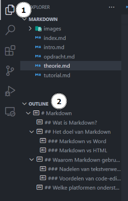

# Een Markdown bestand maken

1. Maak een nieuw bestand en geef het de **.md** of **.markdown** extensie.
2. Schrijf tekst in de **Markdown-syntax**, in je favoriete **code-editor**.

## Syntax

- [Interactieve Tutorial](https://www.markdowntutorial.com/)
- [Markdown Cheatsheet](https://github.com/im-luka/markdown-cheatsheet)

# Exporteren

## Pandoc Online

[Pandoc Online](https://pandoc.org/try/) is de makkelijkste optie, maar je kan maar **1 Markdown bestand tegelijk** exporteren, en **afbeeldingen werken niet**. 

## Pandoc Command Line Tool

### Installatie

1. Surf naar [pandoc.org](https://pandoc.org), en installeer de laatste versie (voor Windows moet je het **.msi** bestand downloaden).
2. Herstart je computer.
3. Om te testen of de installatie gelukt is open je een terminal: 
   - Windows PowerShell: `Start > Windows PowerShell`
   - VS Code: `ctrl + shift + p > Create New Terminal`
   
   Voer dit command uit: `pandoc --version`, als je geen error krijgt is de installatie gelukt.

### Gebruik

1. Open een terminal op de plek van je Markdown bestanden:
   - Windows PowerShell: `Rechter klik > Openen in Terminal`
   - VS Code: `ctrl + shift + p > Create New Terminal`
2. `pandoc index.md -s -o index.docx`
   - `-s`: Deze vlag staat voor "**standalone**". Het wordt gebruikt om een volledig document te genereren, in plaats van een fragment van een document.
   - `-o index.docx`: Deze vlag geeft het "**output**" bestand.

---

# Markdown & VS Code

Hieronder enkele handige tips om met Markdown te werken in VS Code. 
Voor nog meer tips kan je terecht in de [officiële VS Code documentatie](https://code.visualstudio.com/Docs/languages/markdown).

## Outline overview

De **Outline View onderaan de File Explorer** toont de structuur van het open Markdown bestand en kan dienen als een soort **inhoudstafel**.

## Afbeeldingen slepen

Vanuit de **File Explorer** kan je afbeeldingen slepen met de `shift` toets, vergeet niet de `alt text` aan te passen.

