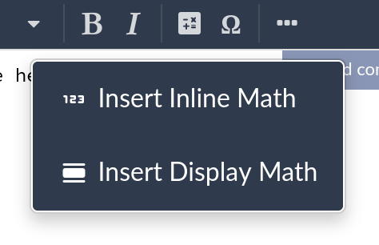
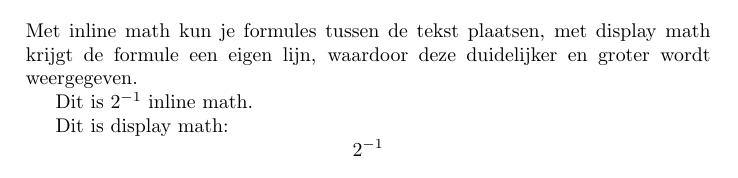

1. Om een wiskunde formule in te voegen klik je bovenaan op de **insert math** knop.  
{: .square }{: width='50px' }  
2. Daarna heb je de keuze tussen **Inline Math** en **Display Math**.  
{: .square }{: width='250px' }

- **Inline Math**  
	Hiermee plaats je de formule **in een lijn tekst**, zoals een `<span>`-tag in HTML.  
	**Syntax**: `\( ... \)` (vervand de ... door je formule).
- **Display Math**  
	Hiermee krijgt de formule een **eigen lijn**, zoals een `<div>`-tag in HTML.  
	**Syntax**: `\[ ... \]` (vervand de ... door je formule).

{: .frame }{: width='500px' }

```latex
Dit is \(2^{-1}\) inline math.

Dit is display math:
\[2^{-1}\]
```

# LaTeX-formule syntax

| Wiskundige notatie | LaTeX code |
|-------------------:|:-----------|
| {: .square } | `2^3` |
| {: .square } | `2^{-1}` |
| {: .square } | `2^{5 \cdot 1}` |
| {: .square } | `D_N(x)` |
| {: .square } | `3^2_5` |
| {: .square } | `A\,{\widehat {=}}\,0` |
| {: .square } | `A\,{\widehat {x}}\,0` |
| {: .square } | `\{1,\ldots ,q-1\}` |

Je kan heel ver gaan in het opbouwen van formules, hieronder enkele voorbeelden:

## Dirac-vergelijking
{: .square }
```latex
\left(i\gamma^\mu \partial_\mu - m\right)\psi = 0
```

## Schrödingervergelijking
{: .square }
```latex
i\hbar\frac{\partial}{\partial t}\Psi(\mathbf{r},t) = \left(-\frac{\hbar^2}{2m}\nabla^2 + V(\mathbf{r},t)\right)\Psi(\mathbf{r},t)
```

## Maxwell-vergelijkingen
{: .square }
```latex
\begin{align*}
\nabla \cdot \mathbf{E} &= \frac{\rho}{\varepsilon_0} \\
\nabla \cdot \mathbf{B} &= 0 \\
\nabla \times \mathbf{E} &= -\frac{\partial \mathbf{B}}{\partial t} \\
\nabla \times \mathbf{B} &= \mu_0 \mathbf{J} + \mu_0 \varepsilon_0 \frac{\partial \mathbf{E}}{\partial t}
\end{align*}
```

# Stand-alone LaTeX math editors

Er zijn online LaTeX editors gespecialiseerd in formules, meestal worden deze editors gebruikt om **afbeeldingen van formules** te maken die in andere kantoor softwarepakketten ingevoegd worden.

Voor onderstaande editors heb je **geen account** nodig:
- [LaTeX to SVG convertor](https://viereck.ch/latex-to-svg/)
- [https://latex.codecogs.com/eqneditor/editor.php](https://latex.codecogs.com/eqneditor/editor.php)
- [https://latexeditor.lagrida.com/](https://latexeditor.lagrida.com/)
- [https://math-editor.online/](https://math-editor.online/)
- [https://www.commontools.org/tool/latex-compiler-and-equation-writer-18](https://www.commontools.org/tool/latex-compiler-and-equation-writer-18)