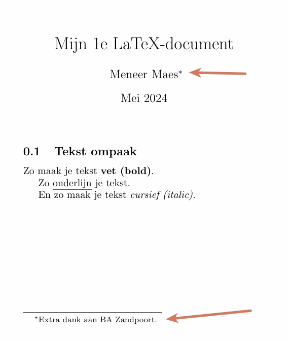

# Stap 1: Kies een algoritme

Kies 1 algoritme uit de onderstaande lijst:

**Informatica**
- Zoekalgoritmen & logaritmen
- Beeldverwerking & matrices
- Grafische weergave, animatie & sinus- en cosinusfuncties
- Program Evaluation Review Techniek
- Netwerksnelheid & bandwidth-delay product
- De wet van Snellius

**Blockchain**
- Het gebruik van matrices in blockchain
- Hashfuncties & bitwise operaties

**Encryptie**
- Caesar cipher & Vigenère cipher
- Quantum-Resistant Encryption
- Discrete logaritmen & het Diffie-Hellman algoritme
- Discrete logaritmen & het ElGamal encryptiesysteem
- Additive Homomorphic Encryption
- RSA encryptie & matrices *(moeilijk){: .badText }*



# Stap 2: Onderzoek

Beantwoord volgende vragen over je gekozen algoritme.
- Leg het **begrip en algoritme** zo duidelijk mogelijk uit.
- Sinds wanneer is het in gebruik.
- Geef **praktische voorbeelden** die te maken hebben met **informatica, computers, internet, ...**

# Stap 3: LaTeX paper & formule

Gebruik LaTeX om een paper te schrijven over de bevindingen van je onderzoek.  
Voeg een LaTeX-formule toe en leg deze uit.  
Kijk in de puntenverdeling waaraan je paper moet voldoen.

**Alle informatie over LaTeX die je nodig hebt kan je hier terugvinden:**  
[https://www.overleaf.com/learn/latex/Learn_LaTeX_in_30_minutes](https://www.overleaf.com/learn/latex/Learn_LaTeX_in_30_minutes)

## Uploaden
Je upload **2 documenten**:
- Je paper in **PDF-formaat**
- Een **tekst-document** *(word, kladblok, ...)* met je **code**.



## Extra dank aan de auteur

Dit is wat ik bedoel met **je geeft extra dank aan een persoon**.

{: width="400px" }{: .frame }