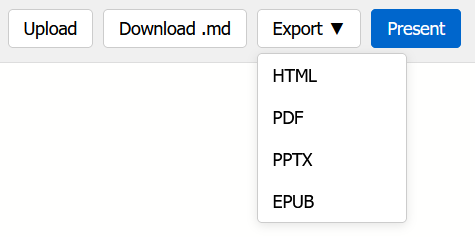

Gebruik deze online tool om de presentaties te maken met Markdown code: [https://marp-editor.ocatools.com/](https://marp-editor.ocatools.com/)

# Onderwerpen 

Dit zijn voorbeelden van wat je kan vertellen over jezelf, maar je kiest zelf wat en hoe veel je over jezelf wil delen:
- Waar je woont 
- Hoe je naar school komt 
- Wat je hobby's zijn 
- Wat je tijdens de vakantie gedaan hebt 
- Wat je graag zou willen leren tijdens deze lessen 
- Welke games je speelt 
- Welke muziek je luistert
- Welke series je kijkt
- ...

# Voorbeeldcode

Gebruik deze voorbeeld code als startpunt:

```markdown
---
backgroundColor: darkcyan
color: lightcyan
footer: Markdown Presentatie
header: Maes
---

# Hoofdstitel
## Ondertitel
Gewone tekst schrijf je gewoon zoals dit.
- Iets **vetgedrukt maken** doe je met twee asterisk symbolen.
- Iets *schuin gedrukt* maken doe je met één asterisk.

---

# Een nieuwe slide
Een nieuwe slide maak je met drie streepjes:

---

# Titels
## Een kleinere titel
### Nog kleiner

---

# Lijstjes
- Eerste punt
- Tweede punt
- Derde punt

Je kunt ook een genummerde lijst maken:
1. Eerste stap
2. Tweede stap
3. Derde stap

---
# Styling

Geef 1 slide een uniek design

--- 

# Even oefenen
Maak zelf een presentatie met:
- Een **titelpagina**
- Minstens **5 slides**
- Verschillende titels
- Een lijstje
- **Vetgedrukte** tekst
- *schuingedrukte* tekst

---
<!-- _backgroundColor: black-->
<!-- _color: white -->

# Tips
- Hou je slides eenvoudig.
- Laat plaats over voor de afbeeldingen die we straks gaan toevoegen

# Uitdaging 
- Kan jij achterhalen waarom deze slide een uniek ontwerp heeft?
```

# Downloaden, exporteren, presenteren en uploaden

{: .frame }

- **Download.md:**  
  Je huidige presentatie **opslaan als een .md-bestand**. Je kunt dit bestand later opnieuw openen in de Marp Editor of verder bewerken
- **Export:**  
  Je presentatie opslaan als bijvoorbeeld PDF, PowerPoint of HTML
- **Upload:**  
  Een bestaand **.md-bestand openen**
- **Present:**  
  Je presentatie **volledig scherm tonen**, zoals tijdens een echte presentatie

# Afbeeldingen 

```markdown
# Afbeeldingen
Gebruik voor afbeeldingen een **URL naar een afbeelding die op internet staat**.


---

# Vergroten & verkleinen

## Width instellen


## Height instellen


---

# Achtergrond afbeelding


---

# Achtergrond afbeelding schalen


---

# Achtergrond afbeelding op de rechter helft


---

# Doorschijnend

- 0 = volledig transparant
- 1 = volledig zichtbaar

---

# Eigenschappen combineren

```

# Ontdek zelf nieuwe Markdown codes 

Ga zelf op ontdekking en gebruik [deze website](https://github.com/im-luka/markdown-cheatsheet) om nieuwe markdown codes te ontdekken.

# Uploaden 

Je upload enkel je **markdown code** in de uploadzone.

# Puntenverdeling

 
