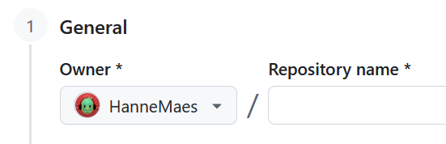
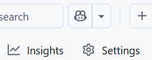
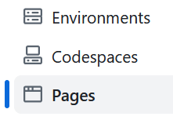
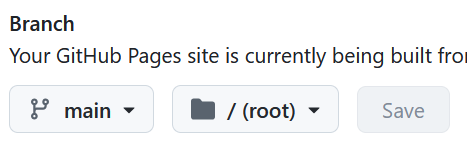
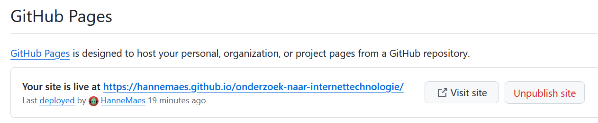

# GitHub

> Een Platform voor Versiebeheer en Samenwerking

GitHub is een krachtig platform voor softwareontwikkeling en versiebeheer, gebaseerd op Git. Het wordt wereldwijd gebruikt door ontwikkelaars, bedrijven en open-source projecten. Met GitHub kun je:

- Je code opslaan en bijhouden hoe deze in de loop van de tijd verandert.
- Samenwerken met anderen door middel van pull requests en code reviews.
- Issues en projectbeheerfuncties gebruiken om werk te organiseren.

GitHub maakt het gemakkelijk om je werk met anderen te delen, of je nu alleen werkt of in een team.

# GitHub Pages

> Gratis Hosting voor Statische Websites

GitHub Pages is een gratis service van GitHub waarmee je eenvoudig statische websites kunt publiceren.

Omdat GitHub Pages statische bestanden host (zoals HTML, CSS, JavaScript en Markdown), is het supersnel en betrouwbaar. Bovendien hoef je geen complexe serverconfiguraties te beheren.

# Waarom een Markdown-Website Publiceren op GitHub Pages?

Markdown is een eenvoudige en leesbare opmaaktaal waarmee je gestructureerde documenten kunt maken zonder dat je HTML hoeft te schrijven. Het combineren van Markdown met GitHub Pages biedt verschillende voordelen:

## Eenvoudig te schrijven en te onderhouden

Markdown is veel eenvoudiger dan HTML. Je kunt je website onderhouden alsof je een tekstbestand bewerkt, zonder gedoe met complexe code. Dit maakt het toegankelijk voor zowel beginners als gevorderden.

## Automatische conversie naar HTML

GitHub Pages ondersteunt Jekyll, een tool die automatisch je Markdown-bestanden omzet in een nette website. Hierdoor hoef je je geen zorgen te maken over het handmatig omzetten van bestanden.

## Perfect voor documentatie

Markdown is ideaal voor documentatie, zoals handleidingen of projectbeschrijvingen. Veel open-source projecten hosten hun documentatie via GitHub Pages, omdat het eenvoudig te beheren is.

## Directe versiegeschiedenis en samenwerking

Omdat je Markdown-bestanden in een GitHub-repository opslaat, kun je altijd teruggaan naar eerdere versies en samenwerken met anderen via pull requests. Dit is vooral handig als je met een team werkt aan een wiki, handleiding of blog.

## Gratis en snel online

In tegenstelling tot veel andere hostingdiensten is GitHub Pages gratis en snel. Je hoeft geen domeinnaam of serverruimte te kopen, en je site wordt gehost op GitHub’s betrouwbare infrastructuur.

## Makkelijk aanpasbaar met thema’s en CSS

Wil je een mooiere uitstraling? Je kunt eenvoudig Jekyll-thema’s gebruiken of je eigen CSS toevoegen om de stijl van je site aan te passen. Dit geeft je flexibiliteit zonder de complexiteit van een traditionele website.

# Hoe publiceer je Markdown-bestanden via GitHub Pages?

1. Maak een **account** aan op [github.com](https://github.com).
2. Maak **nieuwe repository**.  
  - Een repository or repo kan je zien als een online map voor een project, maar dan met extra mogelijkheden om de geschiedenis en samenwerking van je bestanden bij te houden.
3. Geef je repository een naam  
  {: .frame width='100' }  
4. Click op   
5. Click op , maak een nieuwe file aan of upload een bestaande .md-file.  
  **Het is belangrijk dat je files de naam `index.md` heeft.**  
  Dit bestand is de **startpagina** van je website.  
  
6. Ga naar  
  
7. Selecteer  
  
8. Bij **Branch** selecteer je  en   
  
9. **Wacht** to GitHub klaar is met je site te **builden**, je site is klaar als je bij de Pages instellingen de URL van je website te zien krijgt:  
  
