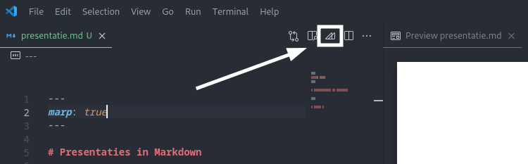
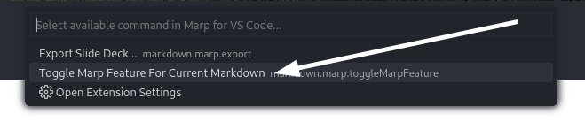
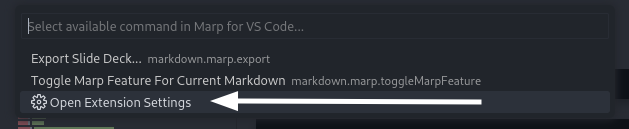

<!-- global css -->
<style>
    strong {
        color: #00d4ff;
    }
    a {
        text-decoration: underline;
    }
</style>

<!-- single slide CSS -->
<style scoped>
    h1 {
        margin-left: auto;
        margin-right: auto;
        background-color: black;
        padding-bottom: 10px;
        padding-top: 5px;
        padding-left:  80px;
        padding-right: 80px;
    }
</style>


# Presentaties in Markdown

---

<!-- single slide CSS -->
<style scoped>
    h1 {
        margin-left: auto;
        margin-right: auto;
        background-color: black;
        padding-bottom: 10px;
        padding-top: 5px;
        padding-left:  80px;
        padding-right: 80px;
    }
</style>


# Waarom presenteren Markdown?

---


# Waarom presenteren in Markdown?

- Zet bestaande Markdown **snel** om in een presentatie
- **Focus op de inhoud**
- Pas het **ontwerp** later snel een eenvoudig aan

---

<!-- single slide CSS -->
<style scoped>
    h1 {
        margin-left: auto;
        margin-right: auto;
        background-color: black;
        padding-bottom: 10px;
        padding-top: 5px;
        padding-left:  80px;
        padding-right: 80px;
    }
</style>


# Waarom een online presentatie?

---


# Waarom een online presentatie?

- Makkelijke op een **website** te plaatsen
- Toegankelijk voor **iedereen**
- Toegankelijk vanaf **overal** en zonder USB stick
- Iedereen heeft steeds de **laatste versie**
- Geen specifiek software nodig
- Eenvoudig te **delen**

---


# Hoe?

1. Installeer de **Marp for VS Code** extension via [https://marp.app](https://marp.app/#get-started)

---

2. Maak een **.md** bestand met deze code:
```
---
marp: true
---

# Slide 1

---

# Slide 2
```

Deze code **moet bovenaan** staan:
```
---
marp: true
---
```

---

3. Open Preview:
    1. `ctrl + shift + p`
    2. `Open Preview` of `Open Preview to the Side`

    

---

Als de preview geen slides zijn:

1. Klik op het **Marp icoontje**
    
2. Selecteer **Toggle Marp**
    

--- 

# Settings: GLOBAL

Algemene settings plaats je bovenaan je code:

```
---
marp: true
theme: default
---
```

`theme: default` bekijk alle themes [hier](https://github.com/marp-team/marp-core/tree/main/themes)
`class: invert` voeg dit toe voor **dark mode**
`paginate: true` voeg **pagina nummers** toe
`footer: by Hanne Maes` voeg een **footer** toe
`header: Markdown presentaties` voeg een **header** toe

---
<!-- single slide settings -->
<!-- _backgroundColor: white -->
<!-- _color: black -->

# Settings: SINGLE SLIDE

Settings voor 1 slide plaats je **bovenaan** de slide:

```
<!-- _backgroundColor: white -->
<!-- _color: black -->
```

---

# Custom css: SINGLE SLIDE

Custom CSS voor 1 slide plaats je **bovenaan** de slide:

```
<style scoped>
    * {
        font-size: 24px;
    }
</style>
```

---

# Custom CSS: GLOBAL

Global custom CSS plaats je **direct onder de marp settings**:

```
---
marp: true
---

<style>
    strong {
        color: #00d4ff;
    }
</style>
```

> **TIP:** exporteer je presentatie naar .html en gebruik de **Developer Tools** om CSS elementen te vinden.

---

# Presentatie exporteren

Kies het export type:

1. Klik op het **Marp icoontje**
2. Selecteer **Open Extension Settings**
    
3. Export Type: **html** of **pptx**
4. Klik op het **Marp icoontje** en selecteer **Export Slide Deck**

---

<!-- single slide CSS -->
<style scoped>
    * {
    font-size: 24px;
    }
</style>

> Alle nodig info kan je in de [officiële documentatie](https://marpit.marp.app/markdown) terugvinden

|   **Puntenverdeling**      | **/16** |
|---|---|
| Hoe duidelijk en uitgebreid is je presentatie | /2 |
| Een theme | /2 |
| Afbeelding waarvan je de grootte zelf bepaald | /2 |
| Header en/of footer | /2 |
| Header en/of footer met image | /2 |
| Slide met background image | /2 |
| Slide met background image op de helft van het scherm | /2 |
| Je publiceert je presentatie via GitHub pages en maakt een link vanuit index.md | /2 |

