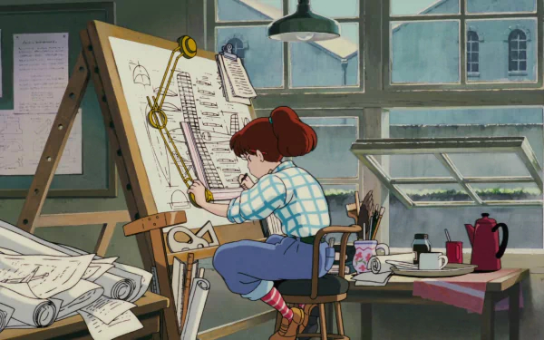
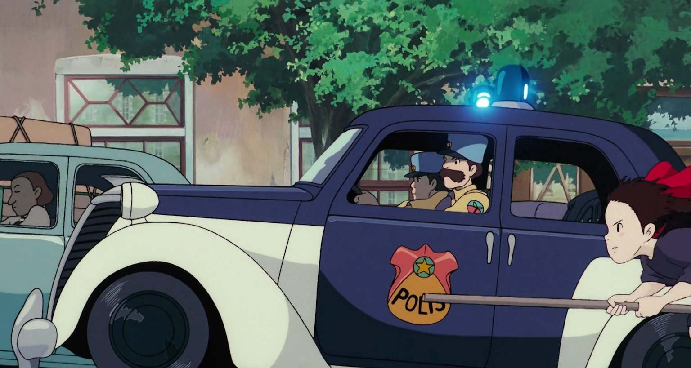

# Digitale Hoofdkwartier

Dit is de plek waar alles samenkomt en georganiseerd wordt. Denk aan het hoofdkwartier van een team of organisatie.

Jouw digitale hoofdkwartier is dus jouw **persoonlijke, slimme en overzichtelijke plek waar je al je schoolbestanden bewaart, ordent en terugvindt**. Geen chaos meer op je bureaublad, maar een systeem dat werkt.

## Je missie 

Welkom, digitale agent.

Vanaf vandaag start je met je eerste missie. Jouw taak is eenvoudig, maar belangrijk: je bouwt een digitaal hoofdkwartier waarin je al je schoolwerk kan **bewaren, terugvinden en veilig organiseren**.

## Klasdiscussie

<iframe src="https://docs.google.com/presentation/d/e/2PACX-1vSBXQuEtfIf4Jz3AxY7ZfR9y3SLz1-EjEORjdTxuHgO2pd4ub6xEgESD5W0MjiQf3BlOxeCWvR8lreI/embed?start=false&loop=false&delayms=3000" frameborder="0" width="1280" height="515" allowfullscreen="true" mozallowfullscreen="true" webkitallowfullscreen="true"></iframe>

## Stap 1: Infiltreer de cloud


Er is een probleem: digitale bestanden raken vaak kwijt, staan op de verkeerde plaats of zijn niet goed beveiligd. **Aan jou om dit mysterie op te lossen**.

Je krijgt een korte onderzoeksmissie. Je werkt zelfstandig en gaat **op ontdekking in de wereld van de cloud** en bestandsopslag. Door goed na te denken en de vragen in te vullen, verzamel je de informatie die je nodig hebt om straks je eigen slimme en veilige digitale werkplek te bouwen.

> Succes, agent. De cloud wacht op je!



## Stap 2: Bouw je Digitale hoofdkwartier

Agent, je onderzoek is **geslaagd**.  
Nu is het tijd om je kennis om te zetten in **actie**.

Dit is de mappenstructuur die we zo meteen gaan bouwen in **Google Drive**:
```
School
└── Seminarie IT
    ├── Opdrachten
    │   ├── Bezig
    │   └── Afgewerkt
    └── Back-ups
```

### Wat betekent map?

| Map                    | Functie                                                 |
| ----------------       | ---------------------------------------------------     |
| `Opdrachten/Bezig`     | Hier werk je aan opdrachten die nog **niet** klaar zijn |
| `Opdrachten/Afgewerkt` | Alles wat **volledig afgewerkt** is                     |
| `Back-ups`             | Reservekopieën van **belangrijke** bestanden            |









## Stap 3: Kleurcodes

Geef **elke map een eigen kleur** en gebruik altijd **dezelfde kleur per soort map**.  
Waarom? Omdat kleuren je helpen om **sneller te herkennen, minder te moeten zoeken**.



> In een goed georganiseerd hoofdkwartier zie je in één oogopslag waar alles zit

## Stap 4: Digitale Survival Gids

> Je digitale hoofdkwartier is gebouwd… maar een hoofdkwartier is pas sterk als het goed gebruikt wordt.

**Basisregels** van elke digitale agent:
- Gebruik duidelijke **bestandsnamen**
- Werk **altijd** binnen je mappenstructuur
- Laat je bureaublad niet veranderen in een rommelzone
- **Verwijder** oude of dubbele bestanden
- Gebruik dezelfde structuur in **andere vakken**





# CODE 3-2-1

Agent, je Digitale hoofdkwartier is bijna operationeel.  
Maar er ontbreekt nog één cruciale verdedigingslaag: **data protection**.

Zonder back-ups is elke digitale structuur **kwetsbaar**.


## De 3-2-1 back-up regel

Elke digitale agent moet dit protocol **kennen en toepassen**:
- **3 kopieën** van je bestanden  
  *Het originele + 2 extra kopieën*
- **2 verschillende soorten** opslag  
  *Laptop, smartphone, usb-stick, ...*
- **1 externe kopie** *Een andere plek of toestel buiten je hoofdwerkplek*

**Waarom is dit zo belangrijk?**
- Je laptop kan crashen of kapot gaan
- Je cloud account kan niet bereikbaar zijn
- Je kan per ongeluk bestanden verwijderen
- Je huis kan afbranden

> Maar met het 3-2-1 protocol blijft je werk altijd herstelbaar.



{% include toggle.html title="2. Je hebt je taak opgeslagen op je laptop én op een USB-stick. Je laptop zit in je boekentas en je USB-stick steekt in het zijvakje van diezelfde boekentas. Je fietst door een enorme storm en je boekentas wordt volledig doordrenkt met water: je laptop én je USB-stick zijn kapot. Welk deel van de 3-2-1 regel had dit kunnen voorkomen?" content="
Dit had voorkomen kunnen worden door de '1' uit de regel: **1 externe kopie** (een kopie op een andere plek). Omdat beide kopieën op exact dezelfde fysieke plek waren (in je boekentas), ben je ze nu allebei kwijt. Als je een derde kopie in de cloud had staan, was er niets aan de hand geweest.
" %}

{% include toggle.html title="3. Je bent heel goed bezig: je hebt je bestand opgeslagen op je laptop, op de harde schijf van je broer én op de computer van je mama. Je hebt dus 3 kopieën. Plots slaat de bliksem in bij jullie thuis en gaan alle computers in huis tegelijk kapot. Welke fout tegen de 3-2-1 regel is hier gemaakt?" content="
Ook hier is de fout dat er geen **externe kopie buiten het huis** was. Hoewel je 3 kopieën had op verschillende toestellen, stonden ze allemaal in hetzelfde gebouw. Bij een brand of blikseminslag ben je dan alsnog alles kwijt. Een back-up in de cloud (die in een ander gebouw staat) had dit opgelost.
" %}

{% include toggle.html title="4. Een hacker blokkeert jouw Google-account en je kunt plotseling niet meer inloggen in je Google Drive-cloud waar al je schoolwerk staat. Gelukkig pas jij de 3-2-1 regel toe. Waarom is dit voor jou geen ramp?" content="
Omdat de regel zegt dat je **2 verschillende soorten opslag** moet gebruiken. Je hebt je bestanden niet alléén in de cloud staan, maar je hebt ook een lokale kopie op de harde schijf van je laptop of op een fysieke USB-stick. Je kunt dus gewoon bij je bestanden terwijl Google jouw account herstelt.
" %}

# Missie: Bouw je eigen 3-2-1 systeem



Agent, je Digitale hoofdkwartier is operationeel...  
maar er is nog een kritieke ontbrekende module: **data-bescherming**.

Vanaf nu werk je niet alleen met mappen en structuur.  
Je bouwt een systeem dat je werk kan **overleven bij elke ramp**.

Je bent nu officieel aangesteld als: **Digital Hoofdkwartier System Designer** Jouw taak: ontwerp een back-up systeem dat je bestanden **altijd veilig houdt**, zelfs als alles fout gaat.


## Stap 1: Position Check 

Voordat je begint, denk even na als echte agent: **In welk deel van je digitale hoofdkwartier ga je deze opdracht plaatsen?**
- `Opdrachten/Bezig`
- `Opdrachten/Afgewerkt`
- `Opdrachten/Afgewerkt`
- `Back-ups`
- In een andere map?



## Stap 2: Je eigen back-up strategie



# Zip-Bestanden

<iframe src="https://docs.google.com/presentation/d/e/2PACX-1vQjmBdZ7PIlVqBnDr29IkpB5RfcuqDvK2q21EYqo95TsohDu2I0VzbbYotMUo45Uw/pubembed?start=false&loop=false&delayms=3000" frameborder="0" width="1280" height="515" allowfullscreen="true" mozallowfullscreen="true" webkitallowfullscreen="true"></iframe>






# Smartschool Cloud


Agent, er is nog een **verborgen laag** in je digitale hoofdkwartier die **vaak vergeten wordt**.

Naast je eigen cloudopslag bestaat er nog een extra veilige zone: **de documenten en uploadzone van Smartschool**.

- Alleen jij hebt toegang tot je **documenten** op smartschool
- Je kan bestanden uit de **uploadzone**, terug downloaden

## Laatste Missie: Smartschool Back-up

Agent, je Digitale HQ is gebouwd.  
Je mappenstructuur is operationeel.  
Je back-up systeem staat klaar.  

Maar... een echte cyberagent stopt nooit zonder een **laatste veiligheidscontrole**.

Je gaat nu een **volledige reservekopie** van je digitale hoofdkwartier veiligstellen in de **uploadzone van Smartschool**.



> MISSION COMPLETE!



Je bent nu een **echte cyberagent** want je hebt:
- Een duidelijke mappenstructuur
- Een cloudwerkplek
- Een lokale kopie
- Een externe reservekopie
- Een volledig actief back-up systeem