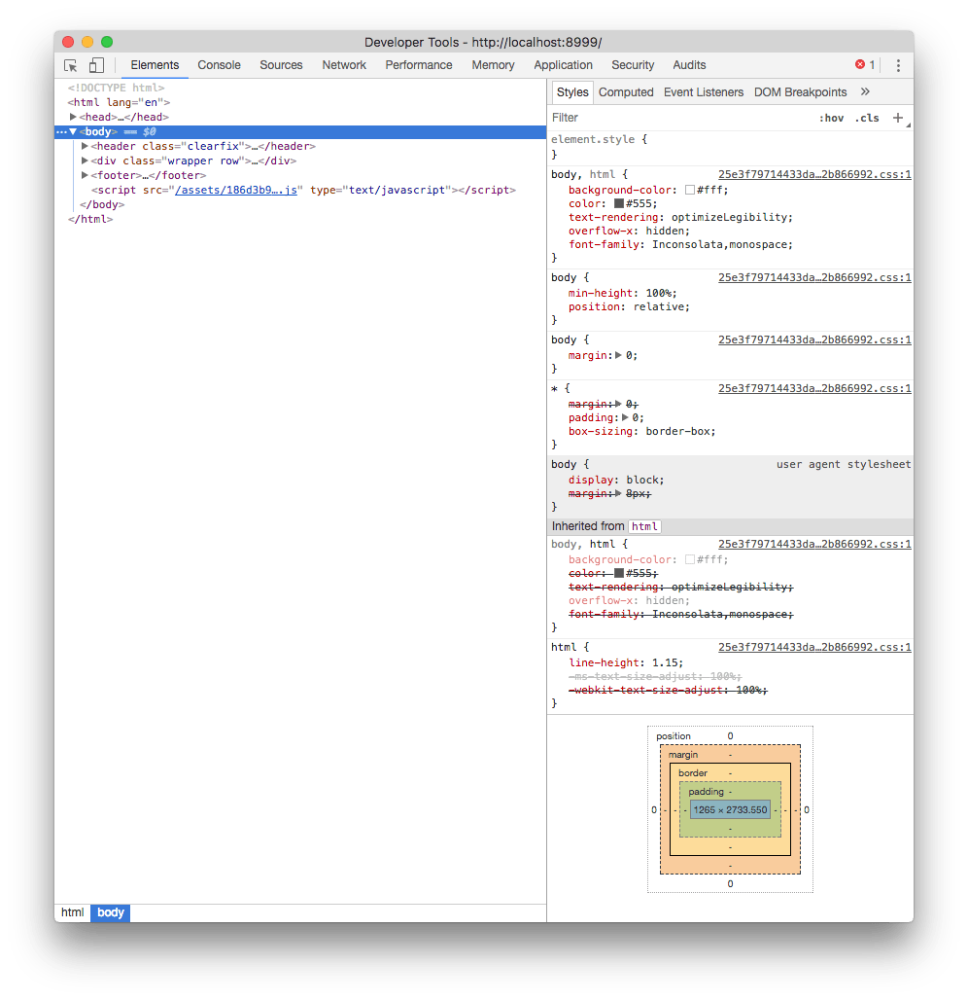

Browser Developer Tools zijn **ingebouwde hulpmiddelen** in webbrowsers, om webdesigners te helpen.

# Hoe open je de browser developer tools?

- **F12**
- **ctrl**-**shift**-**i**
- Rechtermuisklik > **Inspect** of **Inspecteren**
