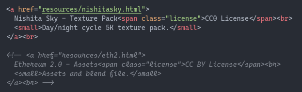
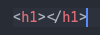
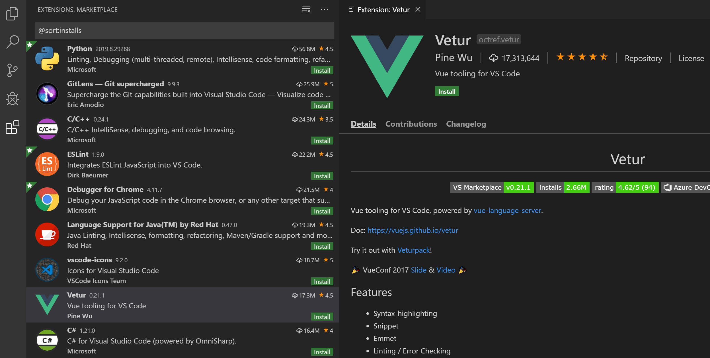

We kunnen HTML-code schrijven in kladblok, of elk ander tekst programma. Maar er zijn ook programma’s gespecialiseerd in het schrijven van code.

**Deze programma's noemt men code editors.**

# Wat zijn de voordelen van code editors?

## Color coding

{: .frame }

## Automatisch code aanvullen

Je hoeft enkel de open tag te schrijven en de closing tag verschijnt automatisch!

{: .frame }

## IntelliSense

{: .frame }

## Error highlights

{: .frame }

## Extensions, theme’s, …

{: .frame }

## En nog veel meer!

> Visual Studio Code is met reden tegenwoordig de populairste code editor.
