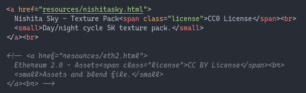
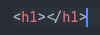
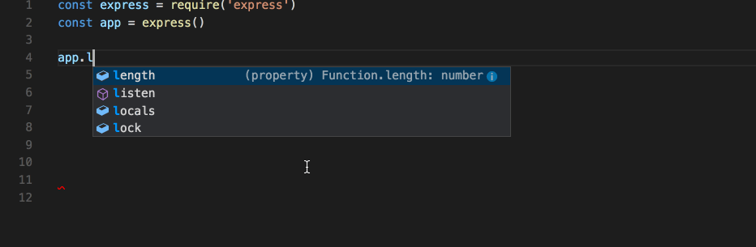
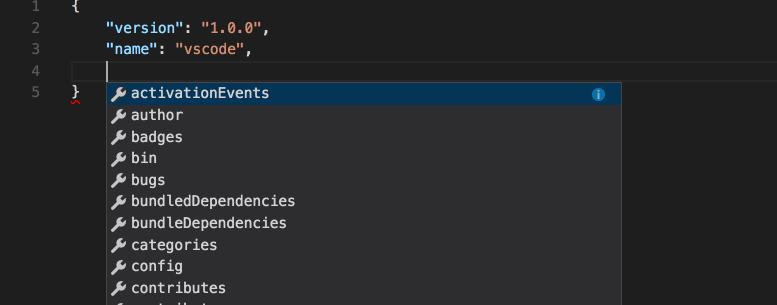
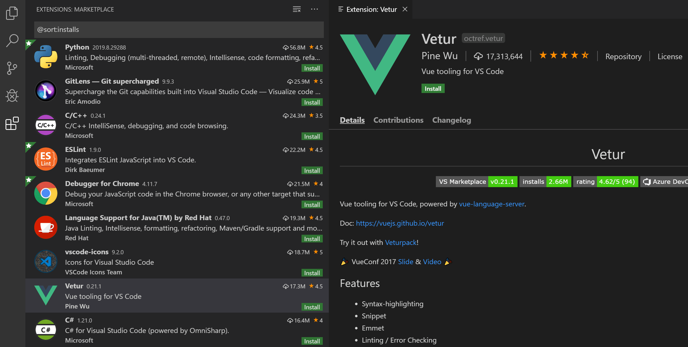

We kunnen HTML-code schrijven in kladblok, of elk ander tekst programma. Maar er zijn ook programma’s gespecialiseerd in het schrijven van code.

**Deze programma's noemt men code editors.**

# Wat zijn de voordelen van code editors?

## Color coding

{: .frame }

## Automatisch code aanvullen

Je hoeft enkel de open tag te schrijven en de closing tag verschijnt automatisch!

{: .frame }

## IntelliSense

{: .frame }

## Error highlights

{: .frame }

## Extensions, theme’s, …

{: .frame }

## En nog veel meer!

# Een code editor installeren 

## VSCode

{: .wrap }
Tegenwoordig een van de populairste code editors. Het bevat echter steeds meer AI-functies, zoals AI-autocomplete en code suggestions. Hoewel deze functies handig kunnen zijn bij het programmeren, kunnen ze het leren van webtechnology moeilijker maken: **je leert minder goed zelf code schrijven en begrijpen wanneer de editor voortdurend oplossingen voorstelt**.

## VSCodium

{: .wrap }
Een open-source fork van VSCode. Het biedt vrijwel dezelfde programmeeromgeving en uitbreidingen, maar **zonder de ingebouwde Microsoft-telemetrie en AI-functies** van VSCode. Daardoor is VSCodium een goede keuze om webtechnology te leren: **je schrijft de code zelf en krijgt pas hulp wanneer je daar bewust naar op zoek gaat**.

Download VSCodium via [https://vscodium.com/](https://vscodium.com/)
