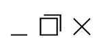

> Nu is het tijd om zelf op te zoeken wat de css-properties **display** en **position** doen.



# Oefening 1: Voorbeelden

## Display

Maak een website waarin je uitlegt wat deze **display-properties** doen, voorzie ook **duidelijke voorbeelden** (voorbeelden gemaakt met code, geen afbeeldingen):
- Block
- Inline-block
- Inline
- None

## Position

Maak een nieuwe pagina waarin je uitlegt wat deze **position-properties** doen, voorzie ook **duidelijke voorbeelden** (voorbeelden gemaakt met code, geen afbeeldingen):
- Absolute
- Fixed
- Relative
- Static

# Oefening 2: Desktop environment

## Mac style dock

Maak een nieuwe website met onderaan een dock.  
Het dock heeft de volgende elementen: icoontjes, background, border en bolletjes.

## Menu bar

Geef je desktop environment een menu bar bovenaan en een wallpaper.

## Window

Geef je desktop environment een window.

Het windows heeft icoontjes voor maximize, minimize en close.  
Op Windows zien deze er zo uit, maar je mag zelf een design kiezen.  

De inhoud van het window mag je zelf kiezen.

