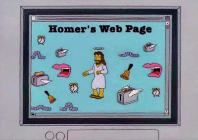

> Hoe is het internet ontstaan en waarom heeft het veel gelijkenissen met word processing software?

**Google document**
{: .frame }

**HTML document**
{: .frame }

# Het Amerikaanse leger

Het internet is ontstaan in de jaren **1960** als een project van het **Amerikaanse leger** genaamd ARPANET. Het was bedoeld om informatie te delen en **communicatie te verbeteren**, vooral in **noodsituaties**.

**HTML (Hypertext Markup Language)** is een taal die is gemaakt om webpagina's te maken en te delen op het internet. Het lijkt op tekstverwerking software omdat beide worden gebruikt om tekst en afbeeldingen op een gestructureerde manier weer te geven.

{: .frame }

# Universiteiten en onderzoekers

Na het oorspronkelijke militaire gebruik werd het internet voornamelijk omarmd door **universiteiten en onderzoekers**.
Ze zagen het potentieel ervan voor **informatie-uitwisseling en samenwerking**, wat leidde tot verdere ontwikkeling en groei van het internet.

{: .frame }

# Vooruitgang

In de **loop der jaren** zijn er veel **nieuwe functies en mogelijkheden** aan HTML en het maken van websites toegevoegd, waardoor ze veel meer kunnen dan tekstverwerking software.

De toevoeging van nieuwe functies aan web ontwikkeling is vooral **te danken aan technologische vooruitgang**, de **vraag van gebruikers** naar rijkere online-ervaringen, de behoefte van **bedrijven** aan effectieve online aanwezigheid, de **opkomst van mobiele apparaten** en de invloed van **open source-technologieën**.

{: .frame }
{: .frame }

# HTML is open-source

Open-source betekent dat de broncode van **HTML vrij beschikbaar is voor iedereen** om te **bekijken**, te **gebruiken**, te **wijzigen** en te **delen**. 
**Niemand is eigenaar** van HTML en **iedereen kan helpen** met ontwikkelen en verbeteren ervan. Dit heeft geleid tot een **enorme snelle vooruitgang** van het internet.

Mensen over de hele wereld kunnen bijdragen aan de ontwikkeling ervan. Ze kunnen nieuwe functies toevoegen, fouten oplossen en ervoor zorgen dat HTML altijd up-to-date blijft met de veranderende behoeften van het web. Kortom, de opensource-aard van HTML heeft bijgedragen aan de voortdurende evolutie en groei van het internet.

{: .frame }

# De allereerste website

De eerste webpagina ging live op **6 augustus 1991**. Deze was gewijd aan informatie over het World Wide Web-project en werd gemaakt door **Tim Berners-Lee**. Het draaide op een computer bij de Europese Organisatie voor Kernonderzoek, CERN.
Deze webpagina gaf een uitleg over hoe webpagina's te maken en gaf meer informatie over hypertext.

Hij staat tot op de dag van vandaag nog steeds online: [http://info.cern.ch/hypertext/WWW/TheProject.html](http://info.cern.ch/hypertext/WWW/TheProject.html)
