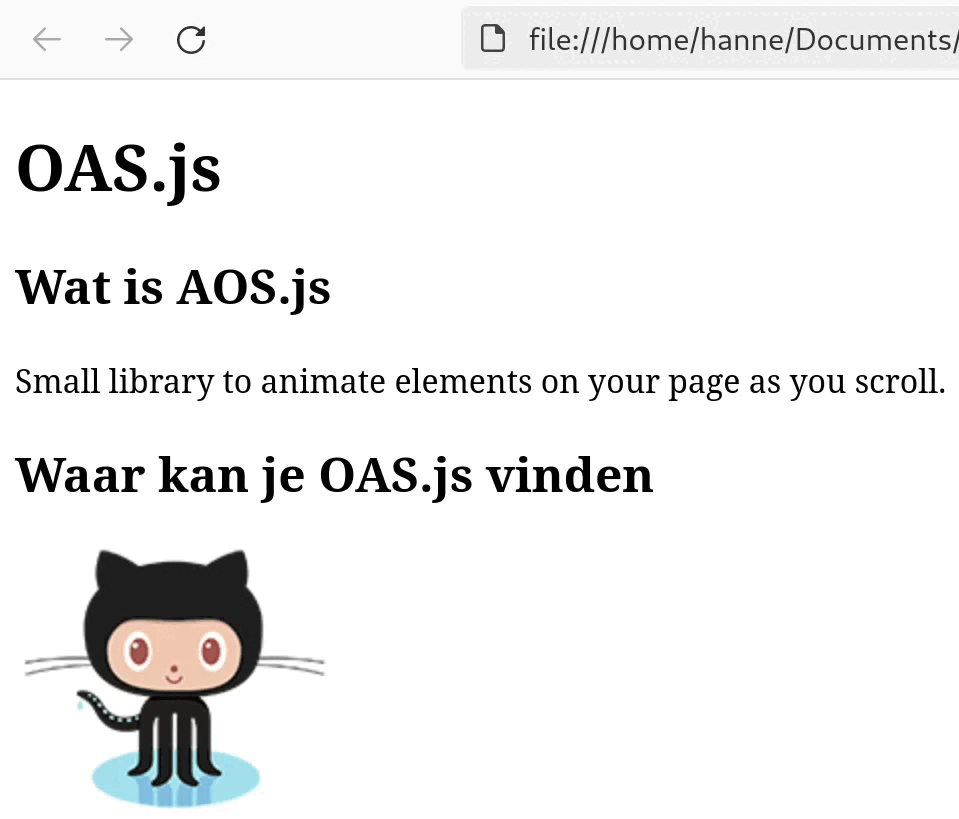

JavaScript- en CSS-libraries zijn verzamelingen van **voorgeprogrammeerde functies en stijlen** die kunnen worden gebruikt om de **ontwikkeling** van webpagina's te **versnellen en verbeteren**.

# Librarie vs framework

- Een **library** biedt een set tools en functies die je kan gebruiken om (meestal kleine) **specifieke taken** uit te voeren.
- Een **framework** bied een een omvattende **structuur en werkwijze** die je **moet** volgen, inclusief richtlijnen en conventies.



# Voorbeeld: OAS.js

**Animate on scroll (AOS.js)** is een **library** die je toelaat elementen met een animatie in beeld te laten komen.

{: width="500" }

1. Surf naar: [https://michalsnik.github.io/aos/](https://michalsnik.github.io/aos/), hier zie je het effect van de libarary.
    Onderaan de pagina zie instructies om de library toe te voegen aan je eigen website.
2. Download en unzip de code.
3. Plaats de bestanden in  in de map van je website, in een folder genaamd . Dit is de code van de library.
    {: width="500" }
4. Link in  naar de **CSS** en **JS** bestanden van de library.  
    `<link rel="stylesheet" href="libraries/aos.css">`  
    `<script src="libraries/aos.js"></script>`
5. Voeg deze code toe om de AOS.js library te starten.  
    ```javascript
    <script>
        AOS.init();
    </script>
    ```
6. Voeg de code voor het effect dat je wil toe aan een HTML-tag.
    ```html
    <h1 data-aos="fade-down">OAS.js</h1>
    ```



## Local files vs hosted files

Library files *(.css, .js)* kunnen lokaal worden gehost, waarbij de bestanden rechtstreeks in de folder van het project worden geplaatst, of extern worden gehost, waarbij de bestanden worden geladen vanaf een externe locatie. 

# Libraries

- [Hover animaties](http://ianlunn.github.io/Hover/)
- [Hover & loading animatie](https://www.csswand.dev/)
- [Reveal animaties](https://www.minimamente.com/project/magic/)
- [Loading animatie](https://nzbin.github.io/three-dots/)
- [Animate on scroll (AOS.JS)](https://michalsnik.github.io/aos/)
- [Hamburger menu's](https://jonsuh.com/hamburgers/)
- [Patterns](https://bansal.io/)
- [Interactieve 3D content](https://threejs.org/)

# Design systems *(framework)*
Kort uileggen wat een design system is.

- [Simple.css](https://simplecss.org/)
- [Google Material Design System](https://materializecss.com/)

# Opdracht

1. Maak een website met een **design system** naar keuze, start met de homepage waarin staat welk **design system** je gekozen hebt en **waarom**. 
2. Maak een pagina met afbeeldingen en gebruik een **lightbox library**.
3. Maak minstens **3** andere pagina's die elk gaan over een **externe libraries**.  
    *Minstens 1 library moet je zelf zoeken en mag niet in de cursus staan.*
    Op elke pagina vermeld je:
- **Welke** library het is en **wat** ze doet.
- Hoe je deze library kan gebruiken, met code voorbeelden.

## Code in code
Les hier uit hoe je code kan laten zien op een pagina zonder deze code uit te voeren.