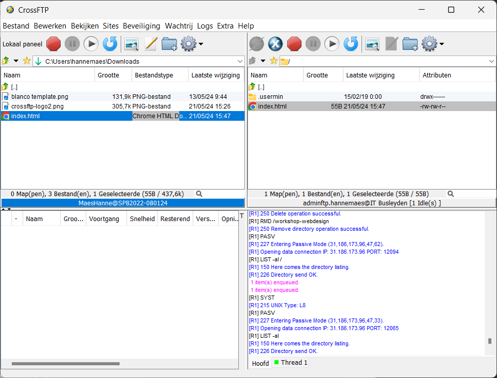

> Staat voor **"File Transfer Protocol"**.

FTP is een netwerkprotocol dat wordt gebruikt om bestanden van de ene computer naar de andere over te brengen via het internet. **FTP maakt het mogelijk om bestanden te beheren op een server**.

# FTP en SFTP

**SFTP (Secure File Transfer Protocol)** is een veiliger alternatief voor FTP omdat het gebruikmaakt van **encryptie** om de gegevens te beschermen **tijdens de overdracht**.
- **FTP** verzendt gegevens in **gewone tekst**, wat betekent dat de gegevens, inclusief gebruikersnamen en wachtwoorden, niet versleuteld zijn. Dit maakt FTP kwetsbaar voor onderschepping en afluistering.
- **SFTP** maakt gebruik van SSH (Secure Shell) om een beveiligde verbinding tot stand te brengen. **Alle gegevens die worden verzonden**, inclusief inloggegevens en bestanden, zijn **versleuteld**.

# Eigen server vs GitHub Pages

Een eigen webserver biedt meer **flexibiliteit en controle** vergeleken met diensten zoals GitHub Pages dat enkel geschikt is voor statische websites, omdat het alleen HTML, CSS en JavaScript ondersteunt.

Met een eigen server hebben we de mogelijkheid om een breder scala aan technologieën en software te installeren en gebruiken, zoals bijvoorbeeld **PHP**.

## Front-end vs Back-end





GitHub Pages staat alleen **front-end** websites toe *(websites die gebruik maken van HTML, CSS en JavaScript)*. Alle berekeningen gebeuren aan de kant van de gebruiker *(in de browser, op het toestel van de gebruiker)*. Dit **minimaliseert de belasting van hun server**, omdat er geen server-side scripts worden uitgevoerd.  

Met een eigen server kun je zowel front-end als back-end technologieën gebruiken. Dit brengt ook risico's met zich mee. Als je website veel bezoekers krijgt, kan de server overbelast raken door de vele back-end berekeningen, wat kan leiden tot crashes.

**Welke delen zijn front-end en welke zijn back-end?**
- Online winkel
- De ChatGPT website
- Crunker.io
- Instagram

# itbusleyden.be

We gaan werken met onze eigen webserver. Iedereen krijgt zijn persoonlijke webpagina op deze server waarop je webcontent kan publiceren. Deze pagina's zullen toegankelijk zijn via individuele URL's, zoals bijvoorbeeld [http://hannemaes.itbusleyden.be/](http://hannemaes.itbusleyden.be/).

# FTP gebruiken

{: width='90px' }{: .wrap }
Er zijn veel FTP-programma's beschikbaar, en een van de meest gebruikte *(op Windows)* is [CrossFTP](https://www.crossftp.com). Dit programma is cross-platform, wat betekent dat het werkt op Linux, MacOS en Windows. Hoewel er een betaalde versie beschikbaar is, biedt de gratis versie alle functionaliteiten die we voor ons gebruik nodig hebben.

CrossFTP bestaat *(net zoals vele andere FTP-programma's)* uit 4 delen:
- **Bovenaan links**: de bestanden op je computer.
- **Bovenaan rechts**: de bestanden op de server.
- **Onderaan links**: de vooruitgang van de bestandsoverdrachten.
- **Onderaan rechts**: berichten en uitleg over alles dat er gebeurt.

Verbinden doe je via .  
Je kan vooraf gemaakte verbindingen aanpassen via .

{: .frame }


