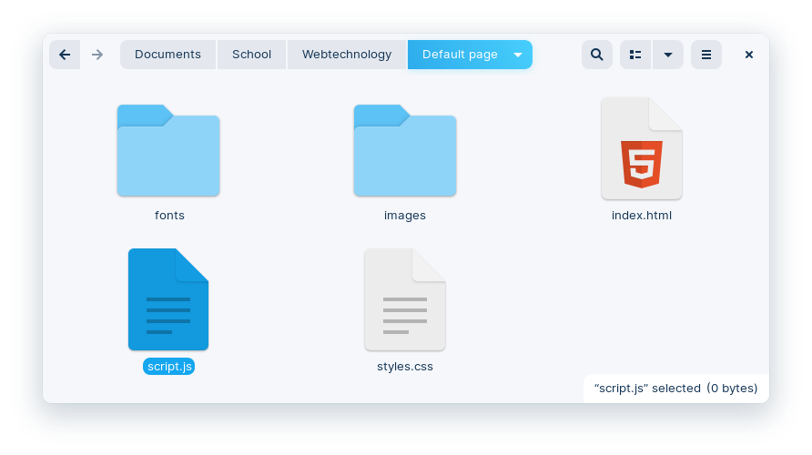
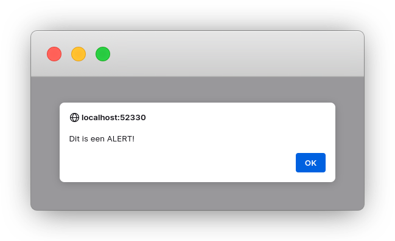
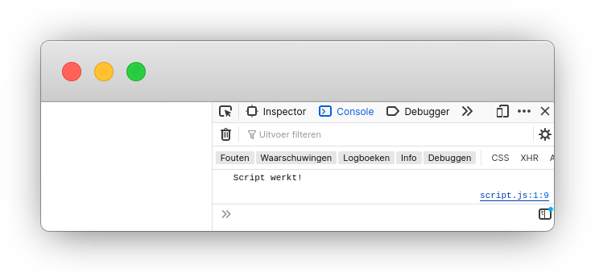
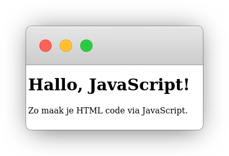

# 1. Maak een script.js bestand aan



# 2. Link naar je JavaScript-bestand

```html
<!doctype html>
<html>
    <head>

        <meta charset="UTF-8" />
        <meta name="viewport" content="width=device-width" />
        <link rel="icon" href="images/favicon.png" />
        <title>JavaScript basics</title>
        <link rel="stylesheet" href="styles.css">

    </head>
    <body>

        <!-- html code ... ->
        <!-- de script-tag moet onderaan body staan -->
        <script src="script.js"></script> 

    </body>
</html>
```

# 3. Schrijf JavaScript code

## Alert

```javascript
document.addEventListener("DOMContentLoaded", function() {
    alert('Dit is een ALERT!');
});
```



## Console.log

**Vervang** de code in script.js door deze code:

```javascript
document.addEventListener("DOMContentLoaded", function() {
    console.log('Script werkt!');
});
```



## HTML-code toevoegen

**Vervang** de code in script.js door deze code:

```javascript
document.addEventListener("DOMContentLoaded", function() {
    document.body.innerHTML = "<h1>Hallo, JavaScript!</h1><p>Zo maak je HTML code via JavaScript.</p>";
});
```



**Multiline strings:**

```javascript
document.addEventListener("DOMContentLoaded", function() {
    document.body.innerHTML = `
        <h1>Hallo, JavaScript!</h1>
        <p>Zo maak je HTML code via JavaScript.</p>
      `
    ;
});
```

## Random word toevoegen

 

```html
<h1>Random word</h1>
<p>Maneer Maes is <mark id="randomText"></mark>.</p>

<!-- de script tag moet onderaan de pagina staan -->
<script src="script.js"></script>
```

**Vervang** de code in script.js door deze code:

```javascript
document.addEventListener("DOMContentLoaded", function() {
    // Lijst met willekeurige woorden
    let randomWords = ["awesome", "cool", "de beste", "fantastisch", "uitzonderlijk", "indrukwekkend"];

    // Kies een willekeurig woord
    let chosenWord = Math.floor(Math.random() * randomWords.length);

    // Voeg het gekozen woord toen aand de HTML-tag met id="randomText" 
    document.getElementById("randomText").innerHTML = randomWords[chosenWord];
});
```

# 4. JavaScript basisprincipes

## `;` (puntkomma)

JavaScript gebruikt het puntkomma (;) symbool als een **statement terminator**, wat betekent dat het aangeeft waar een bepaald statement eindigt.

**Je moet dus elke lijn code eindigen met een ; symbool!**

Het gebruik van puntkomma's in JavaScript is niet strikt noodzakelijk vanwege automatische puntkomma-invoeging. Dit wil zeggen dat wanneer je een ; symbool vergeet, JavaScript gaat gokken waar er ; symbolen moeten komen.
Dit kan echter leiden tot onverwachte resultaten en bugs, vooral wanneer code minified (gecomprimeerd) wordt.
Door puntkomma's expliciet toe te voegen, maak je je code duidelijker en vermijd je mogelijke problemen.

## `<script src="script.js"></script>` (onderaan de pagina)

De code `<script src="script.js"></script>` moet helemaal onderaan **in** de body tag staan.

De browser zal de HTML-content eerst renderen en dan pas het JavaScript-bestand laden. 
- Zo zullen de zichtbare delen van je pagina sneller worden weergegeven.
- En zo zullen de id-tags er reeds zijn wanneer je ze wil aanpassen met html.

## `document.addEventListener("DOMContentLoaded")`

De code `Document.addEventListener("DOMContentLoaded", function() {` zorgt ervoor dat de **JavaScript-code pas wordt uitgevoerd nadat de HTML-pagina volledig is geladen**.

Het is belangrijk dat als je JavaScript-code je HTML-code aanpast dat deze HTML-code al helemaal geladen is. Anders probeer je HTML-code aan te passen die nog niet bestaad en zal je code niet werken.

## Comments

In JavaScript kun je op **2 manieren opmerkingen (comments) toevoegen** aan je code: **enkelvoudige** regelcomments en **meerregelige** comments.

### Enkelvoudige regelcomments

```javascript
// Dit is een enkelvoudige regelcomment
let x = 5; // Je kunt ook comments op dezelfde regel als code plaatsen
```

### Meerregelige comments

```javascript
/*
Dit is een meerregelige comment.
Je kunt hier meerdere regels tekst toevoegen.
Deze comments beginnen met /* en eindigen met */.
*/
let y = 10;
```
