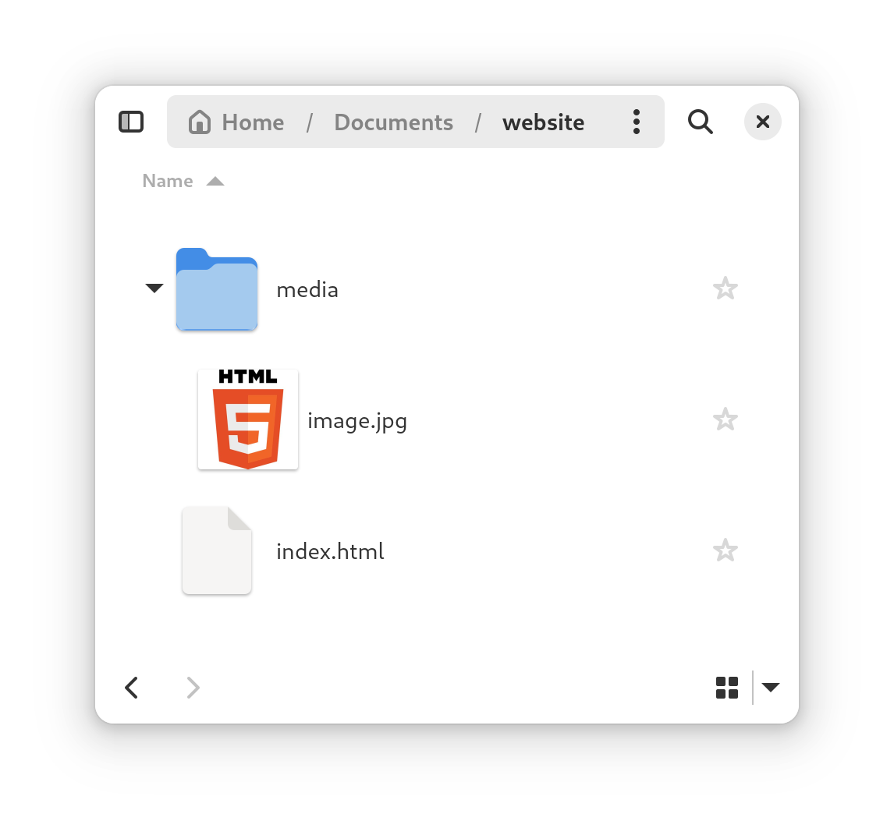

# Externe Links

Externe links verwijzen naar media (afbeeldingen, video's, ...) die **elders op internet zijn opgeslagen**.

```html 

```

**Voordelen:**
- Bespaart opslagruimte in het project.

**Nadelen:**
- Mogelijk tragere laadtijden.
- Risico op onbruikbare links bij verwijdering van de bron.

# Lokale Bestanden

Lokale media zijn bestanden die direct in de **projectmap zijn opgeslagen**.

{: width='500px' }

```html 

```

**Voordelen:**
- Snellere laadtijden
- Onafhankelijkheid van externe servers.
- Offline beschikbaarheid.

**Nadelen:**
- Grotere projectomvang.
- Meer opslagruimte vereist op hosting.

# Organisatie van lokale bestanden

Bij het uploaden of delen van een website is het belangrijk om lokale **mediabestanden correct mee te sturen**, anders zullen deze niet meer werken op je website.

Het is belangrijk de **locatie van het bestand** correct te noteren.

## De afbeelding in de map media.

{: width='500px' }
```html 

```

## De afbeelding in dezelfde map als het .html bestand.

{: width='500px' }
```html 

```
