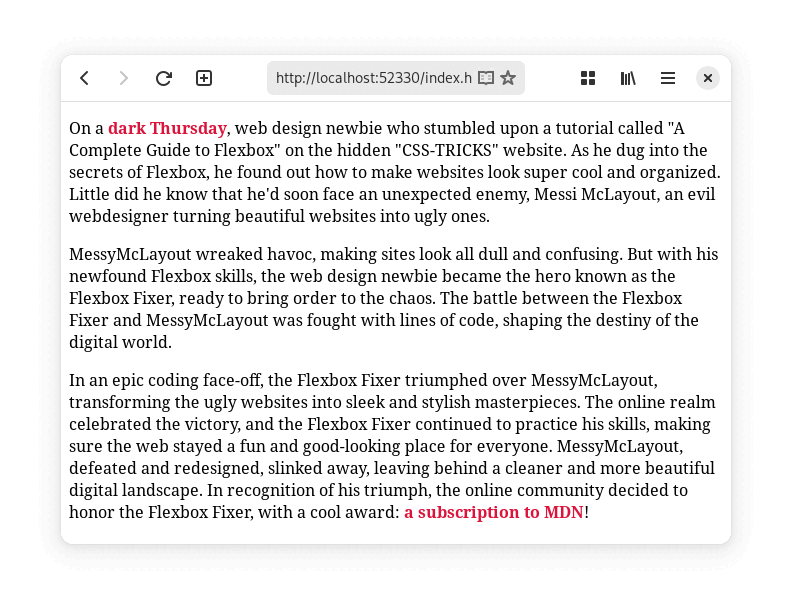
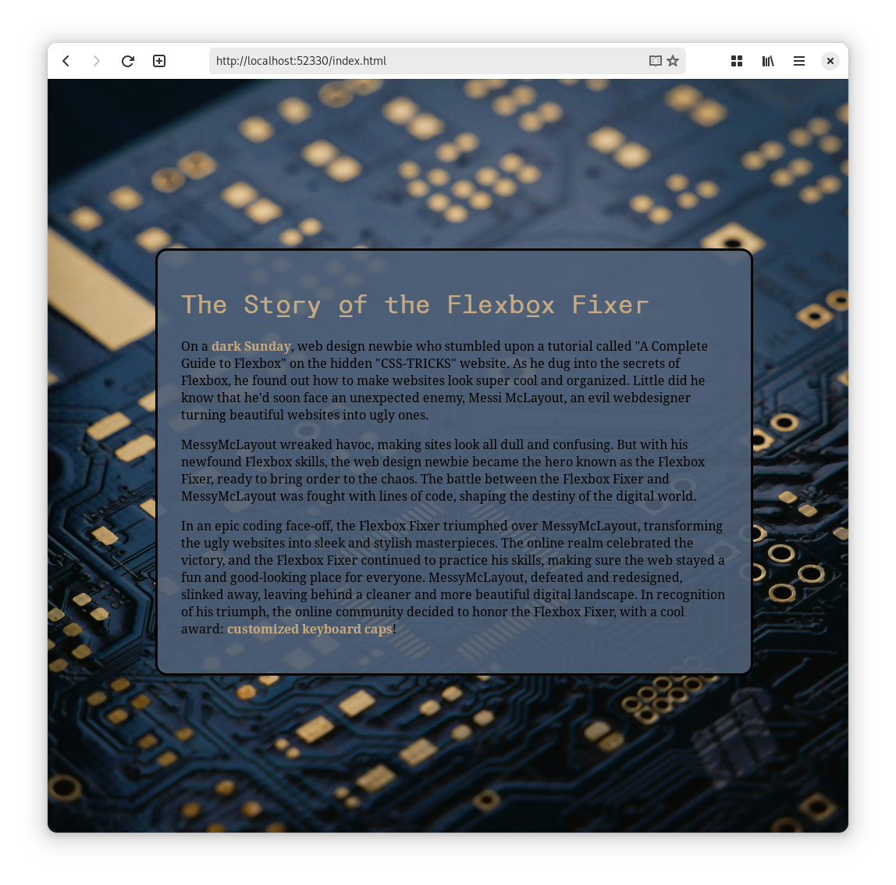

# Stap 1: Random verhaal

Gebruik de kennis uit het vorige hoofdstuk om een dynamische website te maken.  
De website toont een **verhaal met random elementen**.

{: .frame }

Maak een nieuw project aan en start met deze code:

```html
<p>On a <span id="weer">sunny</span> monday.</p>
```

```javascript
document.addEventListener("DOMContentLoaded", function () {
  // weer
  let randomWordsWeer = ["sunny", "rainy", "misty", "hot", "cold", "dark"]; // Lijst met willekeurige woorden
  let chosenWordWeer = Math.floor(Math.random() * randomWordsWeer.length); // Kies een willekeurig woord uit de lijst
  document.getElementById("weer").innerHTML = randomWordsWeer[chosenWordWeer]; // Voeg het gekozen woord toen aand de HTML-tag met de juiste ID
});
```

# Stap 2: CSS-styling

{: .frame }

1. Gebruik CSS om je pagina mooier te maken.
2. Voeg een **titel** toe en geef deze een **lettertype** gedownload van [https://fontesk.com](https://fontesk.com)
3. Voeg via CSS een achtergrond afbeelding toe, deze kan je fullscreen zetten of herhalen als patroon.  
   **Zorg ervoor dat je tekst duidelijk leesbaar blijft!**

# Stap 3: Random afbeelding toevoegen

{: .frame }{: .frame }

Download enkele afbeeldingen en plaats een random afbeelding op je website via JavaScript-code.  
**Het is de bedoeling dat je een afbeelding toevoegt op je pagina, niet dat je de achtergrond afbeelding aanpast.**  
Zorg dat alle afbeeldingen bij elkaar passen en niet een andere stijl of een ander thema hebben.



# Stap 4: Random CSS

Maak de CSS-styling van je pagina ook random.

Bijvoorbeeld als je personage een **wood elf** is kan je zijn of haar naam in het **groen** zetten, maar als je personage een **dragon** is kan je zijn of haar naam in het **rood** zetten. Of als je een **water magic potion** drink kan je deze in een **blauwe achtergrond** geven.

# Stap 5: Random getal

Naast random woorden kunnen we ook random getallen genereren.  
Met deze code genereer je een willekeurig komma getal tussen 0 en 1:

```javascript
Math.random();
```

Om een random komma getal te genereren tussen bijvoorbeeld 0 en 9, kunnen we het vorige getal maal 10 doen, zodat het random getal ook 10 keer zo groot kan zijn:

```javascript
Math.random() * 10;
```

Willen we geen komma getal, maar een geheel getal kan kunnen we het random komma getal afronden met de `Math.floor()` functie.

Deze code geeft ons een willekeurig geheel getal tussen 0 en 9:

```javascript
Math.floor(Math.random() * 10);
```

Willen we een random getal tussen 1 en 10 in plaats van tussen 0 en 9, dan kunnen we het random getal `+1` doen, zodat het geen random getal meer is tussen 0 en 9, maar tussen 1 en 10:

```javascript
Math.floor(Math.random() * 10) + 1;
```

**Voeg nu een random getal toe aan je verhaal.**

# Stap 6: Variabele



## Let

```javascript
let y = 10;
```



Let komt van het Engels en betekent **laat** of **toestaan**.  
Bijvoorbeeld `let y = 10;` of **Let’s give y a value of 10**”.


### Var *(niet gebruiken)*

```javascript
var x = 5;
```



## Const

```javascript
const pi = 3.14;
```



## Datatypes

```javascript
let naam = "Maes";       // string
let level = 100;         // number
let isLeerkracht = true; // boolean

let x = 5;  // number
x = "vijf"; // nu een string
```



## Getallen afronden

```javascript
Math.floor(4.9);  // 4
Math.floor(4.1);  // 4
Math.floor(4.0);  // 4

// Negatieve getallen
Math.floor(-2.1); // -3
Math.floor(-2.9); // -3
```



“Floor” kan je zien als de vloer: alles wat erboven zweeft, valt naar beneden.

**Declareer een variabele die een getal opslaat, en declareer een variabelen die een tekst op slaat en steek deze op meerdere plaatsen in je verhaal.**
