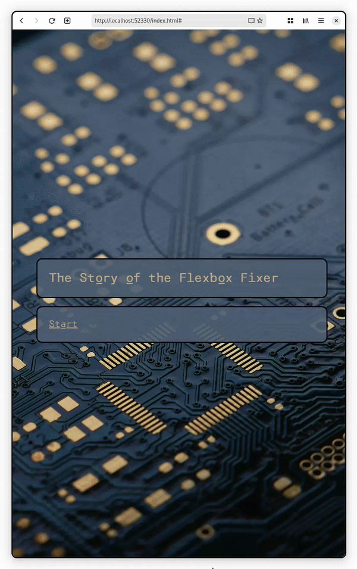
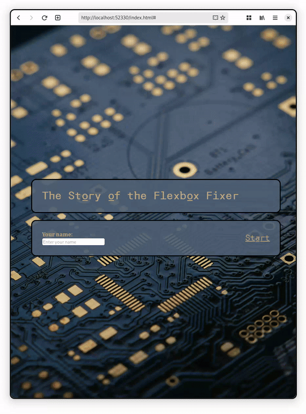
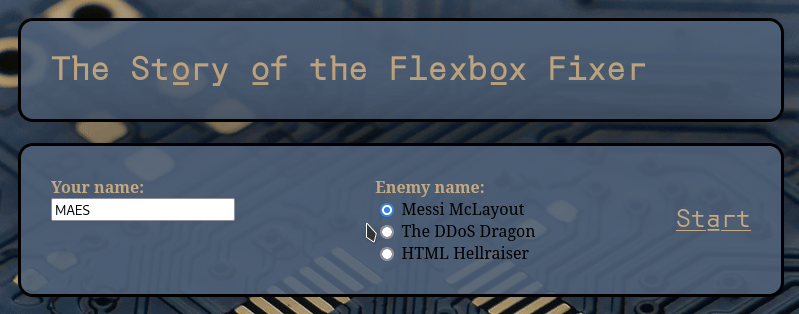
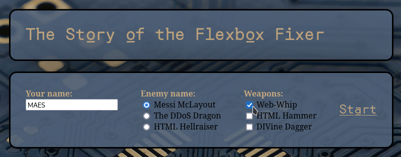
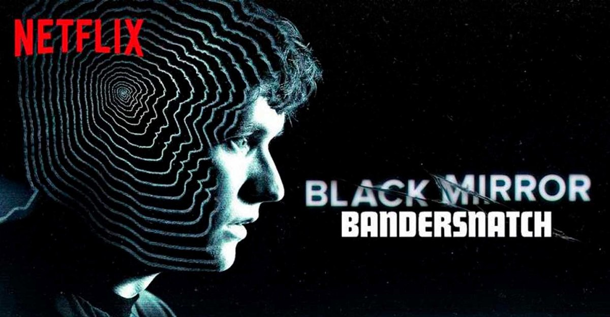
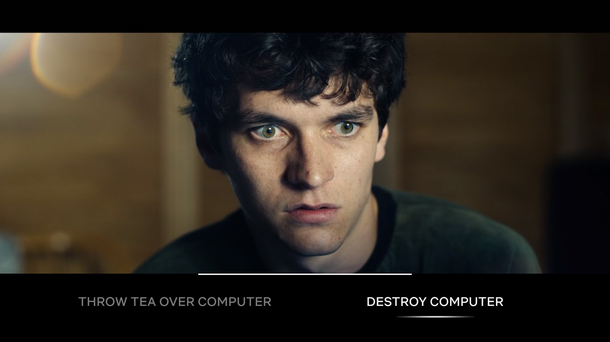

# Stap 1: Knop die het verhaal toont

{: .frame }

1. Verberg je verhaal door het deze CSS-class te geven.

   ```css
   .verborgen {
     display: none;
   }
   ```

2. Maak met de `<a>-tag` een knop om je verhaal te tonen.

   ```html
   <a href="#" id="toonVerhaal">Start</a>
   ```

3. Gebruik deze JavaScript code om HTML-elementen te tonen en verbergen.

   ```javascript
   document.addEventListener("DOMContentLoaded", function () {
     // voer code uit als je op de knop klikt
     document
       .getElementById("toonVerhaal")
       .addEventListener("click", function () {
         // test of de knop werkt
         console.log("Toon verhaal");

         // verwijder en voeg de .verborgen class toe
         document.getElementById("formulier").classList.add("verborgen");
         document.getElementById("verhaal").classList.remove("verborgen");
       });
   });
   ```

# Stap 2: Een tekstveld uitlezen

{: .frame }

1. Start met een HTML-form toe te voegen met daarin een tekstveld.

   ```html
   <form id="formulier" class="frame">
     <div>
       <label class="formTitle">Your name:</label><br />
       <input type="text" id="naamTextfield" placeholder="Enter your name" />
     </div>
   </form>
   ```

2. Haal met JavaScript de waarde uit het tekstveld en sla het op in een variabelen.

   ```javascript
   // haal de naam uit het tekstveld
   let naam = document.getElementById("naamTextfield").value;
   console.log(naam); // testen of het gelukt is
   ```

3. Voeg de naam toe aan het verhaal met de technieken uit de vorige hoofdstukken.
   Geef de naam CSS-styling zodat deze duidelijk zichtbaar is.

# Stap 3: Radio buttons uitlezen

{: .frame }

1. Voeg **radio buttons** toe aan je HTML-formulier.

   ```html
   <label class="formTitle">Enemy name:</label><br />

   <input type="radio" name="enemy" value="Value 1" checked />
   <label>Radio button 1</label><br />

   <input type="radio" name="enemy" value="Value 2" />
   <label>Radio button 2</label><br />
   ```

2. Haal met JavaScript de waarde uit het tekstveld en sla het op in een variabelen.

   ```javascript
   // welke radio button optie is er gekozen?
   let enemyName = document.querySelector('input[name="enemy"]:checked').value;
   console.log("enemyName:", enemyName);
   ```

3. Voeg de gekozen optie toe aan je verhaal.
   Geef de gekozen optie CSS-styling zodat deze duidelijk zichtbaar is.

# Stap 4: Checkbox buttons uitlezen

{: .frame }

1. Voeg **checkbox buttons** toe aan je HTML-formulier.kboxes

   ```html
   <label class="formTitle">Weapons:</label><br />

   <input type="checkbox" id="weapon1" value="Value 1" checked />
   <label>Checkbox 1</label><br />

   <input type="checkbox" id="weapon2" value="Value 2" />
   <label>Checkbox 2</label><br />
   ```

   Je kan op 2 manieren kijken checken checkboxen geselecteerd zijn:

   1. De **manuele** manier:

      ```javascript
      let checkbox1Checked = document.getElementById("weapon1").checked;
      let checkbox1Value = document.getElementById("weapon1").value;
      ```

   2. De **automatische** manier:

      ```javascript
      let checkboxes = document.querySelectorAll('input[type="checkbox"]'); // zet alle checkboxes in een array
      let selectedValues = "";
      checkboxes.forEach(function (checkbox) {
        // loop door alle checkboxes
        if (checkbox.checked) {
          // checked?
          selectedValues += checkbox.value + ", "; // vorige string comma nieuwe
        }
      });
      selectedValues = selectedValues.slice(0, -2); // verwijder de laatste 2 letters van de string ', '
      console.log("Selected values: " + selectedValues);
      ```

2. Voeg de gekozen opties toe aan je verhaal.
   Geef de gekozen opties CSS-styling zodat deze duidelijk zichtbaar is.

# 🏆 Uitbreiding: Choose your own adventure

Creëer een interactief verhaal met meerdere paden, waarbij de lezer zijn eigen beslissingen kan nemen door middel van knoppen die verschillende keuzemogelijkheden presenteren.




