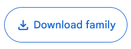
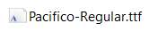
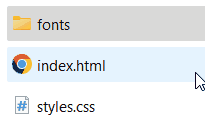

Elke computer wordt geleverd met een standaard set lettertypen die zijn geïnstalleerd op het besturingssysteem. Deze **lettertypen variëren afhankelijk van het besturingssysteem** (zoals Windows, macOS, Linux) en de versie ervan. Omdat verschillende besturingssystemen verschillende lettertypen bevatten, kan een **website er op de computer van de ontwerper anders uitzien dan op de computer van de bezoeker**. Wat er goed uitziet op de ene computer, kan er anders uitzien op een andere computer als die niet hetzelfde lettertype heeft geïnstalleerd.

Web fonts komen hier te hulp. Het zijn **lettertypen die specifiek zijn ontworpen en geoptimaliseerd voor gebruik op websites**.
Wanneer een website een web font gebruikt, downloadt de browser van de gebruiker het specifieke lettertype. Hierdoor zien **alle bezoekers van de website dezelfde lettertypen**, ongeacht welk besturingssysteem ze gebruiken of welke lettertypen ze op hun computer hebben geïnstalleerd.

# Google Fonts

Google Fonts is een **gratis online dienst** van Google waarmee web ontwikkelaars toegang krijgen tot een uitgebreide bibliotheek met verschillende lettertypen die ze kunnen gebruiken op hun websites.

[Browse Fonts - Google Fonts](https://fonts.google.com/)

## Hoe Google Fonts gebruiken

1. Surf naar [https://fonts.google.com/](https://fonts.google.com/) en klik op het font dat je wil gebruiken.
2. Download het font door te klikken op de knop **Download family**.

    {: .frame }

3. Het gedownloade font zit in een ZIP-bestand, pak het bestand uit.
4. Kopieer het font-bestand. Je kan font-bestanden herkennen aan het **icoontje**, en aan de extensies **.otf**, **.ttf** en **.woff**.
    
    {: .frame }
5. Ga naar de folder van je website, maak een nieuwe folder aan genaamd **fonts** en plak hier je font-bestand in.

    {: .frame }
6. Voeg deze **CSS-code** toe aan je website:
    ```css
    @font-face {
        font-family: 'pacifico';
        src: url('fonts/Pacifico-Regular.ttf');
    }
    ```
    - `@font-face` laat ons een font toevoegen aan de website.
    - `font-family` is de **naam van het font**, deze naam mogen we zelf kiezen. 
    Het makkelijkste is om de naam van het font op Google Fonts te kiezen.
    - `src: url('fonts/Pacifico-Regular.ttf');` is de locatie van het font-bestand.
    `fonts/bestandnaam.ttf` wil zeggen dat ons font-bestand in de folder genaamd fonts zit, daarna schrijven we de bestandsnaam van het font.
7. Gebruik het font in je CSS-code:
    
    ```css
    h1 {
        font-family: 'pacifico';
    }
    ```
    
    Deze code wil zeggen dat we alle `<h1>` tags het font geven met de naam **pacifico**.
    Dit is de naam die we in de vorige stap gekozen hebben.
    

# ✏️ Opdracht: Webfonts toevoegen aan je website

Open een van je vorige websites en voeg **minstens 2 verschillende webfonts** toe.

Om meerdere fonts te gebruiken moeten we **2 keer** de `@font-face` code gebruiken:

```css
@font-face {
    font-family: 'pacifico';
    src: url('fonts/Pacifico-Regular.ttf');
}

@font-face {
    font-family: 'roboto';
    src: url('fonts/Roboto-Regular.ttf');
}

p {
    font-family: pacifico;
}

h1, h2 {
    font-family: roboto;
}
```
