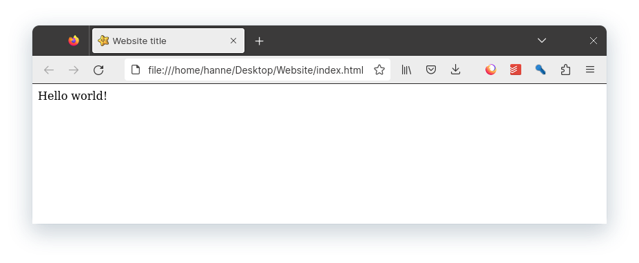
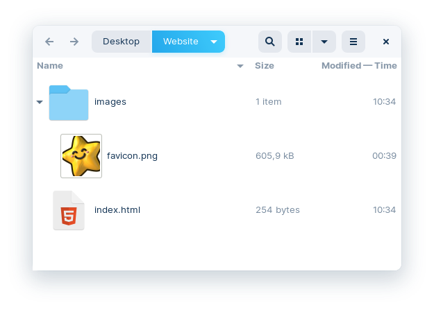

# Correcte HTML-code

Tot hiertoe hebben we eigenlijk onvolledige websites gemaakt.  
Dit is eigenlijk hoe de code van een website eruit moet zien:

```html
<!doctype html>
<html>
  <head>

    <meta charset="UTF-8" />
    <meta name="viewport" content="width=device-width" />
		<link rel="icon" href="images/favicon.png" />
    <title>Website title</title>

  </head>
	<body>

		Hello world!

	</body>
</html>
```

HTML-code werkt zonder deze tags, maar zal minder goed functioneren, hieronder overloop ik alle nieuwe HTML-tags.

## `<!doctype html>`

Dit is een **singular** HTML-tag die de computer laat weten met welke versie van HTML de code geschreven is.

Deze tag geeft aan dat we werken met **HTML5**, de nieuwste versie van HTML.
Ten opzichten van de vorige HTML-versies heeft HTML5 meer multimedia en mobiele functies.

## `<html>`

De `<html>` tag geeft aan waar de HTML-code start en eindigt.

## `<head>`

De `<head>` tag bevat informatie die **niet te zien is op de webpagina** zelf, maar die nuttig is voor de browser of voor zoekmachines zoals Google.

## `<body>`

De `<body>` tag bevat de inhoud van de webpagina die **zichtbaar is voor de gebruiker**.

# Head tags

## `<meta charset="UTF-8" />`

De `<meta charset="UTF-8" />` tag geeft aan met welk alfabet de website werkt.

UTF-8 ondersteunt een brede reeks tekens, waaronder westerse karakters, maar ook karakters uit vele andere talen en speciale symbolen. Hierdoor kan de website teksten in verschillende talen en met verschillende speciale tekens zonder problemen weergeven.

## `<meta name="viewport" content="width=device-width" />`

`<meta name="viewport" content="width=device-width" />` maakt een website responsive.

Dat wil zeggen dat webpagina's zich aanpassen aan de verschillende schermformaten van apparaten, zoals smartphones en tablets, en een betere gebruikerservaring bieden op deze apparaten.

## `<title>Website title</title>`

De `<title>` tag geeft je website een titel.

Deze titel is te zien is zowel de **browser** als in de zoekresultaten van zoekmachines zoals **Google**.


## `<link rel="icon" href="images/favicon.png" />`

Deze tag geeft je website een **favicon**.

Dit favicon is te zien in zowel de **browser** als in de zoekresultaten van zoekmachines zoals **Google**.



Het deel `"images/favicon.png"` wil zeggen dat de afbeelding `favicon.png` in een de folder `images` zit.




