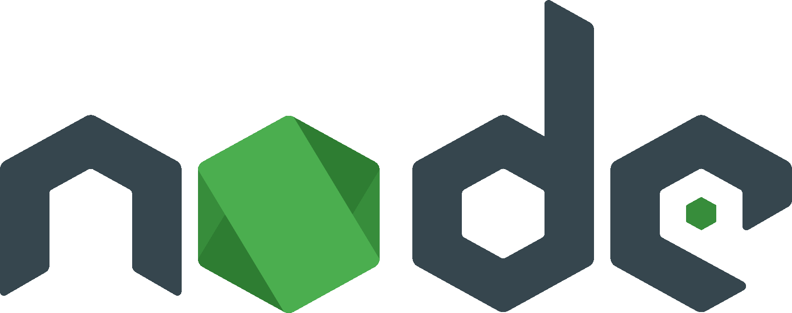

# Wat is Electron?

{: width='150px' }

**Electron.js** is een JavaScript framework waarmee je **desktop-apps kan bouwen met webtechnologie**.  
Dat betekent dat je dezelfde technieken kan gebruiken als bij websites, maar dan om programma’s te maken voor **Windows, macOS en Linux**.

Je kan zelfs een **bestaande website omvormen tot een desktop-app**, door ze in Electron te laden. Zo werken bijvoorbeeld **Discord en VS Code**.

## Hoe werkt Electron?

Electron is in feite **Google Chrome zonder de normale browser-UI** (dus zonder adresbalk, tabs enz.).  
Het start enkel een venster waarin jouw webapp draait, alsof je Chrome start maar alle interface verbergt.

## Waarom Electron?

### Meest moderne UI-technologie:

Geen gedoe met obscure GUI-toolkits die zich gedragen alsof ze uit 1998 ontsnapt zijn. Je gebruikt de meest volwassen, flexibele en wereldwijd ondersteunde UI-technologie die we hebben: HTML en CSS.  
**Animaties, responsief ontwerp, toegankelijkheid, ...**

### Cross-platform:

Je bouwt dingen die op **Web, Windows, MacOS en Linux** draaien zonder drie keer te beginnen. 

### JavaScript everywhere:

Traditioneel heb je 3 soorten developers in een bedrijf:
1. Aan de ene kant heb je de **app-developers** die desktop- of mobiele interfaces bouwen.
2. Aan de andere kant de **backend-engineers** die servers onderhouden en APIs schrijven.
3. Verderop de **web-ontwikkelaars** die voor de browser ontwerpen.  

Dit maakt teams **minder flexibel**. Wanneer iemand ziek is, wanneer een project verschuift, wanneer je snel moet schakelen, bots je op muren.

Als je front-end, backend én desktop-apps in dezelfde taal kunt schrijven, verdwijnt die muur.  
Niet omdat iedereen ineens alles kan, expertise blijft nodig, maar omdat iedereen kan meebewegen.  
**Iedereen spreekt dezelfde basistaal. Begrijpt dezelfde datastructuren.**

Je krijgt teams waar:
- Een front-end ontwikkelaar even een kleine server-bug kan fixen.
- Een backend-dev die iets in de UI kan aanpassen.

# Dependenties

## NodeJS

{: width='250px' }

Node.js is **JavaScript buiten de browser**, op je computer. Hiermee kan JS bestanden lezen, servers draaien en praten met je OS.

## NPM *(Node Package Manager)*

{: width='250px' }

Npm is de **pakketbeheerder** die je een universum aan herbruikbare tools en libraries geeft, zodat je niet alles zelf hoeft te schrijven.  
Denk LEGO-dozen, maar oneindig veel, en je mag ze combineren hoe je wilt.  

- Geeft je toegang tot honderdduizenden kant-en-klare modules.
- Het beheert je dependencies.

# Opdracht 01: Tutorial

[Electrons Basics Tutorial](https://www.tutorialspoint.com/electron/index.htm)

# Opdracht 02: Externe website

Bouw een electron app van een **externe website**.

# Opdracht 03: Lokale website

Bouw een electron app van een **lokale website**.
