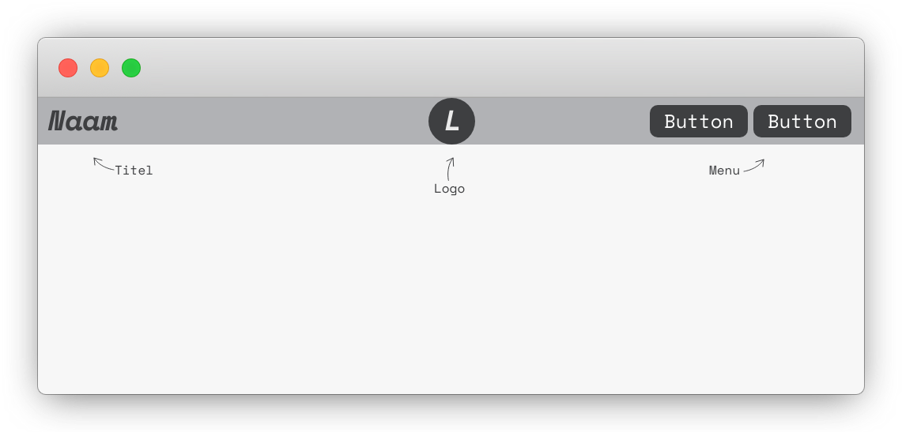
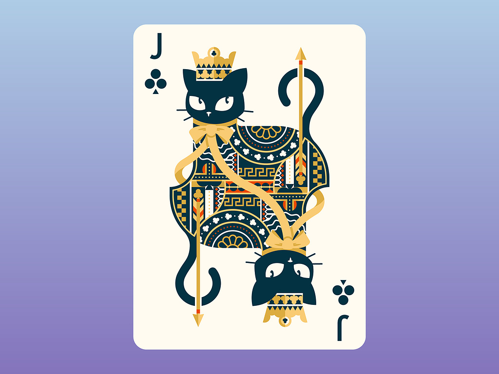
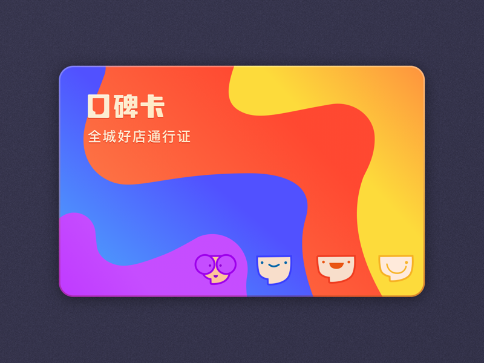
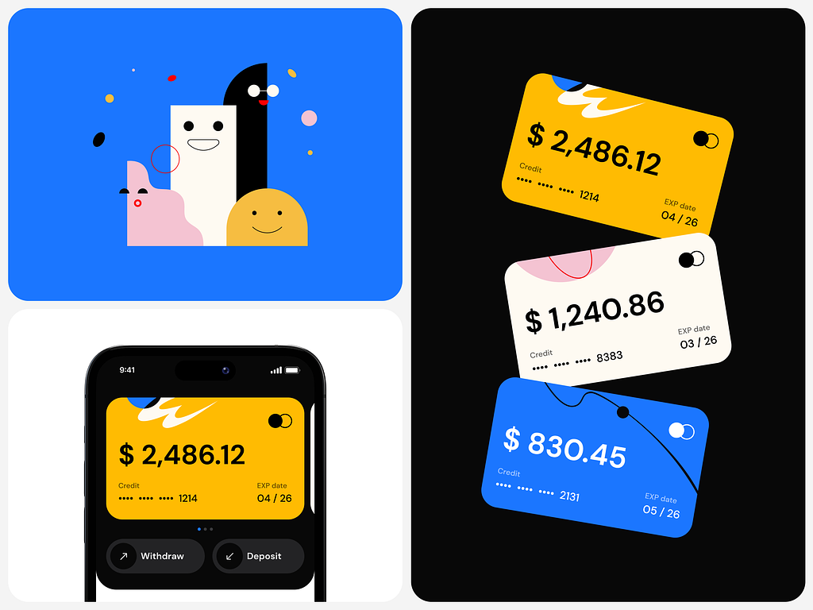
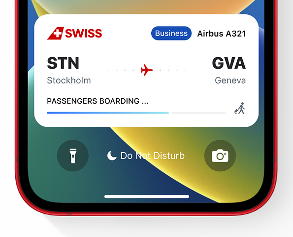
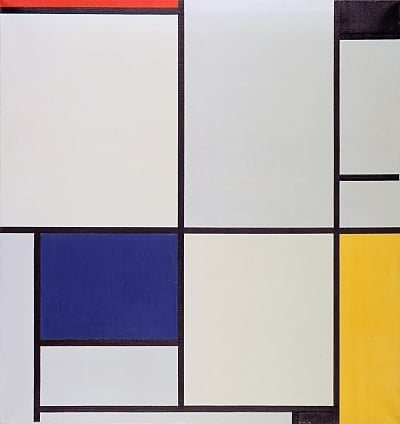
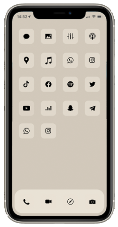

# Flexbox intro

<iframe width="560" height="315" src="https://www.youtube.com/embed/phWxA89Dy94?si=og4ADDivMCmBYykR" title="YouTube video player" frameborder="0" allow="accelerometer; autoplay; clipboard-write; encrypted-media; gyroscope; picture-in-picture; web-share" referrerpolicy="strict-origin-when-cross-origin" allowfullscreen></iframe>

# Flexbox guide



# Oefening 01: Knoppen website aanpassen

Open de knoppen website van de vorige oefening en probeer deze composities na te maken door gebruik te maken van flexbox.  
**Neem telkens een screenshot als het gelukt is.**

[Oefening: Flexbox composities](oef-flexbox-composities)

# Oefening 02: Navigatiebalk



Maak een navigatiebalk die de lay-out heeft van de bovenstaande afbeelding.
Het **logo** mag **geen afbeelding** zijn, maar moet **puur CSS** zijn.

Een navigatiebalk zet je in de `<nav>`-tags

```html
<nav>
  <a href="#">Link 1</a>
  <a href="#">Link 2</a>
</nav>
```

# Oefening 03: Card design

Maak 1 of meerdere van onderstaande card designs na.  
Het design moet niet exact het zelfde zijn, maar de layout wel.  

Ik heb ze zo gerangschikt dat de makkelijkste bovenaan staan en de moeilijkste onderaan.

## Layout 1: Speelkaart



## Layout 2: Bankkaart



## Layout 3: Meerdere elementen





## Layout 4: Boarding pass





# Oefening 04: Piet Mondriaan

Maak dit kunstwerk van Piet Mondriaan na.



# Oefening: iPhone

Maak een iPhone na in HTML en CSS, en geef het deze layout:


