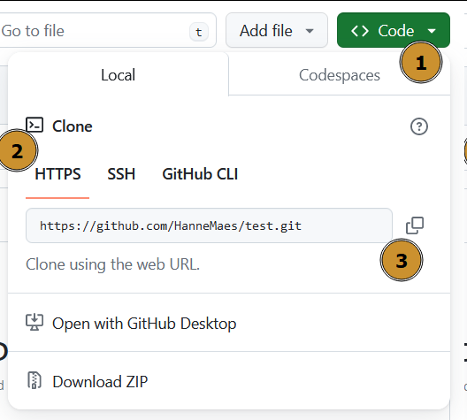
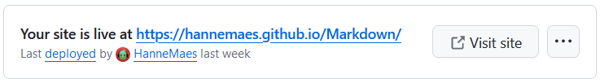

Tijdens deze opdracht gaan we een website **publiceren en onderhouden.** Kies een thema dat je persoonlijk interesseert. Dit kan variëren van hobby's, nieuws, tot persoonlijke projecten. Het belangrijkste is dat je gemotiveerd blijft om de **inhoud regelmatig bij te werken**.

# Stap 1: Ontwerp een website

Begin met het ontwerpen van een overzichtelijke en aantrekkelijke website. Zorg ervoor dat de navigatie duidelijk is en de gebruikerservaring centraal staat.

# Stap 2: Website publiceren op GitHub Pages

## Git downloaden

Controleer of **Git bash** op je computer staat, zo niet download en installeer je het via: [https://gitforwindows.org/](https://gitforwindows.org/)

## Nieuw GitHub project

1. Maak een **nieuwe repository** op GitHub.

   - **Public vs Private**
     - Iedereen kan een **public** repository bekijken en klonen. Ze kunnen ook suggesties voor wijzigingen (pull requests) doen.
     - Alleen mensen die zijn uitgenodigd door de eigenaar van de repository hebben toegang tot een **private** repository. De inhoud is niet zichtbaar voor anderen.  
       Op je website online te zetten via GitHub Pages moet je repository **public** zijn.
   - **Optioneel: Add a README file**
     - Een README-bestand is een markdown bestand dat vaak wordt toegevoegd aan een repository om **belangrijke informatie** te verstrekken. Het kan details bevatten zoals installatie instructies, gebruik, bijdragersrichtlijnen en andere relevante informatie.  
       Het dient als de **startpagina** voor het project.
   - **Optioneel: Add .gitignore**
     - Het .gitignore-bestand wordt gebruikt om bepaalde bestanden of mappen uit te sluiten van versiebeheer.
   - **Optioneel: Choose a license**
     - Het kiezen van een licentie is belangrijk om de voorwaarden te bepalen waaronder anderen je code mogen gebruiken, wijzigen en verspreiden.
     - Een licentie is **niet verplicht**, maar het is **aan te raden** om er een toe te voegen, in lijn met de **principes van open source**.
     - Als je **geen licentie** kiest, wordt je code **automatisch** beschermd door het **auteursrecht**.  
       _Andere kunnen je code bekijken, maar mogen deze niet gebruiken, toch geeft GitHub hen nog steeds de optie je code to clonen._  
       → Hier vind je meer informatie over licenties: [Licenties](licenties)

2. **Clone** je GitHub naar je computer

   1. **Kopieer** de **url** van de repository: `Code > Local > HTTPS`

      {: .frame width='400px' }

   2. Open een **terminal** op de **locatie** waar je **project** moet komen.
      - Windows PowerShell: `Rechter klik > Openen in Terminal`
      - VS Code: `ctrl + shift + p > Create New Terminal`
   3. **Clone** de repository: `git clone <repo url>`  
      Als alles goed gelopen is, heb je nu een folder met de GitHub repository waarin je kan beginnen werken.

3. Kopieer je website naar deze folder.

## Push: Code uploaden

1. Voeg de bestanden toe die je wil pushen (uploaden) naar GitHub.
   - 1 bestand toevoegen: `git add index.html`.
   - Meerdere bestanden toevoegen: `git add index.html styles.css`.
   - Alle bestanden in de locatie toevoegen: `git add *`.
2. Controleer of alle bestanden zijn toegevoegd: `git status`.
   - Wil je de `git add` ongedaan maken, gebruik dat dit command: `git reset`.
3. Als alle bestanden toegevoegd zijn maar je een nieuwe commit: `git commit -m 'message'`.
   - Verander `'message'` door wat je hebt aangepast aan je website, zo heb je een duidelijk overzicht van alle aanpassingen.
4. Push (upload) alle bestanden naar GitHub: `git push`.

Wil je bij een conflict je lokale versie pushen: `git push --force origin main`.

## Website publiceren via GitHub pages

1. `Settings (balk bovenaan) > Pages (balk rechts)`
2. **Branch**: selecteer de folder die je wil publiceren als website.
   - **Master**: publiceer je hele project al website.
   - **Custom folder**: je kan ervoor kiezen enkel een deel van je project te publiceren als website (vaak de `docs/` folder). Zo kan je naast je website ook andere bestanden hebben zoals test- of onafgewerkte pagina’s, design assets, …

Als alles goed gelopen is, krijg je bovenaan de `Pages` pagina in de `Settings` het adres voor je website te zien:

{: .frame width='700px'}
