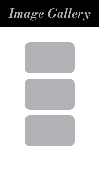
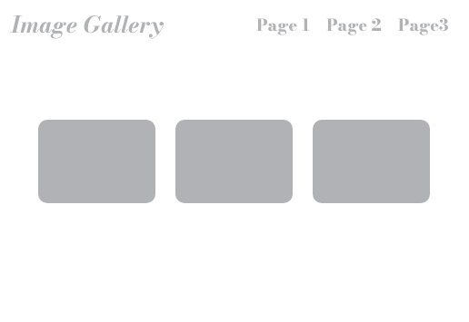
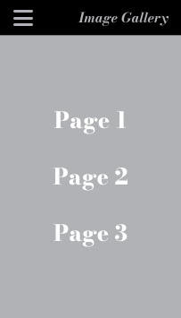

# Media queries

Media queries stellen ons in staat om **specifieke CSS-regels** toe te passen op basis van de **eigenschappen van het apparaat**.


```html
<body>
	Dit is mijn <span class="text"></span> website.
</body>
```

```css
.text::before {
    content: 'desktop';
    color: goldenrod;
    margin-left:  10px;
    margin-right: 10px;
}

/* gebruik deze styling als het scherm 500px of minder breed is */
@media screen and (max-width: 500px) {
    body {
        background-color: black;
        color: white;
    }
    
    .text::before {
        content: 'mobile';
    }
}
```

## Soorten media quaries

### Scherm breedte

```css
/* Schermen kleiner dan of gelijk aan 768px breed */
@media only screen and (max-width: 768px) {
  /* CSS-regels */
}

/* Schermen groter dan 768px breed */
@media only screen and (min-width: 1000px) {
  /* CSS-regels */
}
```

### Oriëntatie (Liggend/Portret)

```css
/* Portrait (verticaal) */
@media only screen and (orientation: portrait) {
  /* CSS-regels */
}

/* Landscape (horizontaal) */
@media only screen and (orientation: landscape) {
  /* CSS-regels */
}

```

## Media queries combineren

Het is mogelijk meerdere **media queries** met elkaar te **combineren**.


```html
<body>
    <p class="orientatie">Oriëntatie</p>
    <p class="text">Font-size</p>
</body>
```

```css
body {
    font-size: 30px;
    color: grey;
}

/**************/
/* orientatie */
/**************/

/* Portrait (verticaal) */
@media only screen and (orientation: portrait) {
    body {
        background-color: black;
        color: white;
    }
    .orientatie::after {
        content: ': portrait';
    }
}
  
/* Landscape (horizontaal) */
@media only screen and (orientation: landscape) {
    body {
        background-color: white;
        color: black;
    }
    .orientatie::after {
        content: ': landscape';
    }
}

/**************/
/* screensize */
/**************/

/* Schermen breder dan 700px */
@media screen and (min-width: 700px) {
    .text {
        font-size: 100px;
    }
    .text::after {
        content: ': 100px';
    }
}

/* Schermen tussen 700px en 530 px breed */
@media screen and (max-width: 700px) and (min-width: 530px) {
    .text {
        font-size: 80px;
    }
    .text::after {
        content: ': 80px';
    }
}

/* Schermen kleiner dan 530px breed */
@media (max-width: 530px) {
    .text {
        font-size: 30px;
    }
    .text::after {
        content: ': 30px';
    }
}
```

# Developer tools

Zowel **Firefox** als **Chrome** hebben ingebouwde opties voor het ontwikkelen van mobiele en responsieve websites in hun **Developer Tools** via  of  of .  


# Oefening: Responsive CSS

## Stap 1: Row vs column




Maak een **responsive gallery website** met minstens 3 afbeelding.
- Desktop:
    - De **afbeeldingen** staan in een **rij**.
    - De **achtergrond** van de titel is **doorschijnend**.
- Mobile:
    - De **afbeeldingen** staan in een **kolom**.
    - De **achtergrond** van de titel heeft een **kleur**.

## Stap 2: Navbar vs hamburger menu




Geef je gallery een **responsive menu**:
- Desktop: 
    - Een **horizontale** navbar.
- Mobile: 
    - Een **hamburger menu** dat een **full-screen menu** opent.

**Tip:** Met deze CSS-regel kan je een HTML-element verwijderen:

```css
.hide {
    display: none;
}
```

# Media query breakpoints

Media query breakpoints zijn de specifieke schermgroottes die je instelt om je design aan te passen, dit zijn veelgebruikte breakpoints.  
Maar pas op, met het grote veranderende aanbod aan toestellen kunnen er altijd uitzonderingen zijn.

- **576px** voor **portrettelefoons**
- **768px** voor **tablets**
- **992px** voor **laptops**
- **1200px** voor **desktop computers**