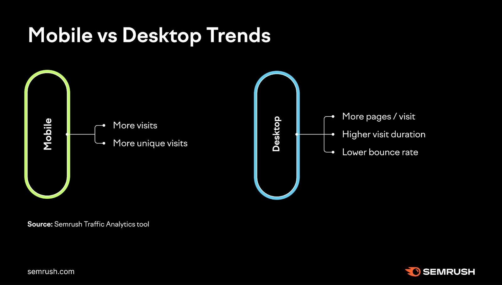

# Wat is mobile-first?

Mobile-first is een **ontwerpfilosofie** waarbij de **focus** ligt op het ontwerpen en van websites en applicaties voor **mobiele apparaten**, voordat er wordt gedacht aan het ontwerp voor desktopcomputers. Deze aanpak staat in contrast met de traditionele benadering waarbij websites eerst worden ontworpen voor desktops en vervolgens worden aangepast aan kleinere schermen.  

Mobile-first stimuleert een meer doordachte benadering van webontwikkeling, waarbij de **behoeften van mobiele gebruikers centraal staan**.  

**Belangrijke aspecten van mobile-first ontwerp zijn onder meer:**
- **Focus op essentiële inhoud**: Omdat mobiele schermen kleiner zijn is er minder plaats voor tekst, het is belangrijk dat de gebruikers van je website meteen de belangrijkste informatie te zien krijgen.
- **Snelle laadtijden**: Mobile apparaten stellen de gebruikers van je website in staat om je website altijd en overal te bekijken. Jammer genoeg is het internet niet overal even snel, daarom is het belangrijk dat je website snel laad.
- **Touchscreen-interactie**: Ontwerpen van gebruikersinterfaces die goed werken met aanraking en gebaren, en die rekening houden met vingers in plaats van muiscursors.

# Data

# Desktop blijft belangrijk

Hoewel de trend van mobiel-gericht ontwerp snel groeit en mobiele apparaten een belangrijke rol spelen in de digitale ervaring van gebruikers, blijft het **ontwerpen voor desktop nog steeds van belang**. 

- **Productiviteit**: Hoewel het gebruik van mobiele apparaten toeneemt, blijven desktopcomputers een belangrijk hulpmiddel voor veel gebruikers, vooral voor complexe taken of bij het werken blijven desktopcomputers dominant. 
- **Complexe inhoud**: Desktopweergaven bieden meer ruimte voor het presenteren van complexe inhoud, zoals uitgebreide grafieken, tabellen, formulieren en lange teksten.

---
title: responsive-mobilefirst.md
date: 2024-03-27 15:35:43 +01:00
---

