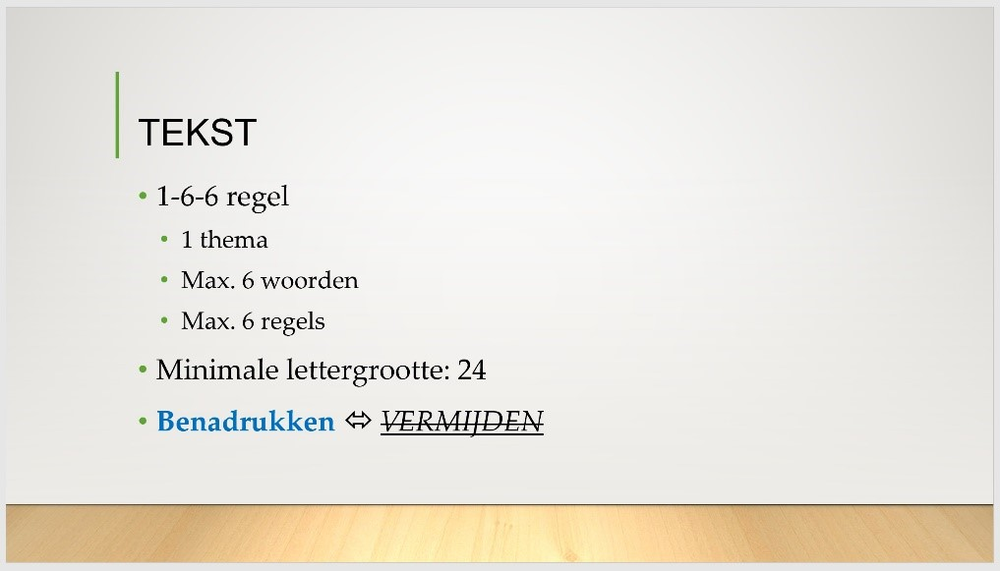
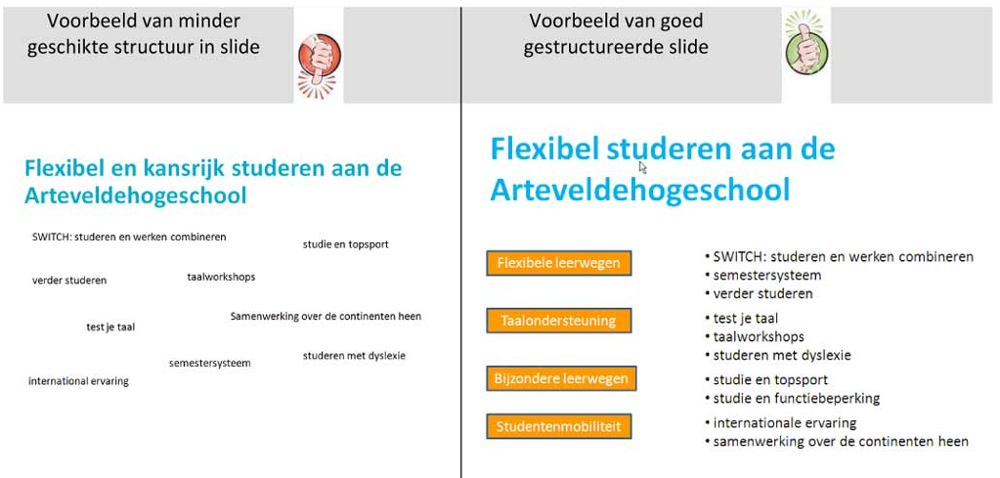
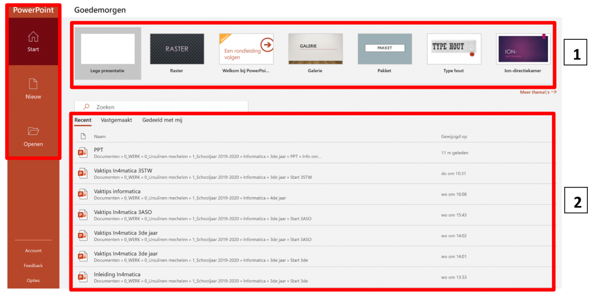
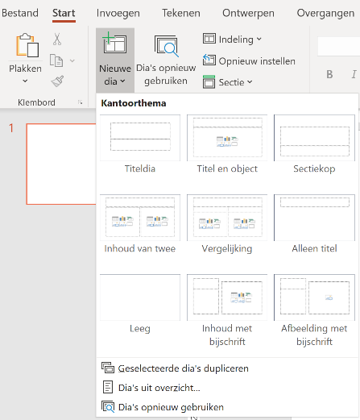
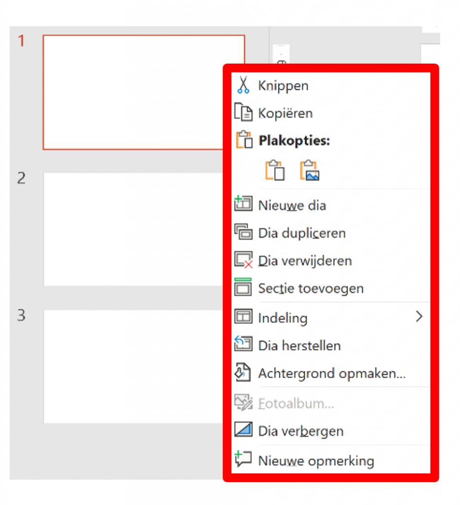
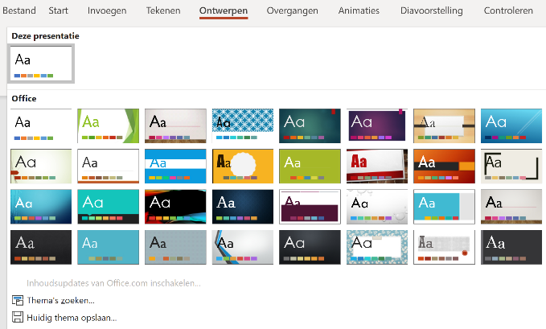
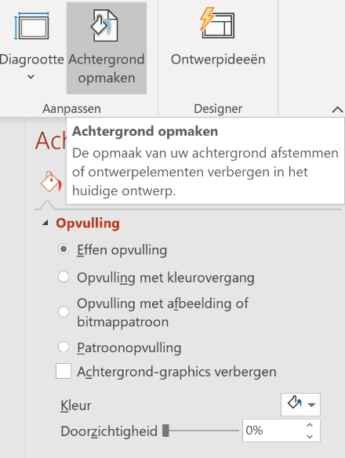

# Basis van een goede presentatie

## Aantal slides

Het verhaal moet van jou komen en niet van wat er op het scherm staat. Beperk daarom het aantal slides in je presentatie.

## Achtergrond

- Kies voor een eenvoudige achtergrond. Vermijd heftige kleuren!
- Kies (indien mogelijk) voor een achtergrond die aangepast is aan je thema of je publiek.
- Zorg voor voldoende contrast tussen de achtergrond en de tekst. Wanneer letters en achtergrond een vergelijkbare kleur hebben wordt de presentatie onleesbaar.

## Tekst

- Hanteer de 1-6-6-regel:
    - 1 thema/onderwerp per dia
    - Maximaal 6 woorden per regel (= kernwoorden)
    - Maximaal 6 regels per dia (= enkel hoofdzaken)
- De lettergrootte moet minimaal 24 punten zijn, of zelfs 28 wanneer je een presentatie moet geven voor een groot publiek!
- Wil je iets benadrukken, plaats je tekst van in het vetjes en/of in een andere kleur. Vermijd HOOFDLETTERS, onderlijnde tekst en cursieve tekst.

## Structuur

Structureer de informatie op de slides.

## Afbeeldingen

Gebruik zo weinig mogelijk tekst en veel beeld. Hoe meer je zelf vertelt en afbeeldingen gebruikt om je verhaal te ondersteunen, hoe meer je publiek ook effectief zal luisteren. Je afbeeldingen moet natuurlijk wel iets te maken hebben met het thema!

## Dia model

Zorg voor een duidelijke en eenvoudige lay-out voor al je slides. Al je slides moeten dezelfde opmaak hebben. De lay-out kan je makkelijk aanpassen via het dia model.

## Animaties

Wees zuinig met het aantal en types van animaties. Dit gaat snel vervelen en zorgt ervoor dat je boodschap verloren gaat.

# Nieuwe presentatie

Wanneer je Microsoft PowerPoint opent, kom je in onderstaande omgeving terecht. In de **balk** aan de **linkerzijde** heb je enkele keuzemogelijkheden.

- **START**: Dit is een overzichtspagina. In de balk bovenaan **(1)** kan je kiezen om een nieuwe presentatie te openen. Hier kan je kiezen voor een lege presentatie of een presentatie in een bepaald thema. In de lijst onderaan **(2)** krijg je een overzicht van de presentaties die je recent hebt gebruikt. Door erop te klikken kan je een presentatie openen.
- **NIEUW**: Via deze optie kan je ook een nieuwe presentatie openen, al dan niet in een thema.
- **OPENEN**: Via deze optie krijg je ook een overzicht van de presentaties die je recent hebt gebruik.

# Structuur en thema

## Werkomgeving

Als je een nieuwe presentatie hebt gestart, dan kom je in onderstaande werkomgeving terecht:

- **LINT**: Via deze balk kan je automatisch opslaan aan en uitzetten, manueel opslaan, stappen teruggaan of verder gaan, de presentatie starten, …
- **DAKBALK**: Deze balk bevat, net als bij de andere programma’s van Microsoft Office, een aantal logische tabbladen met functies voor het aanpassen van je presentatie.
- **WERKOMGEVING**: In de werkomgeving wordt de dia getoond die je momenteel aan het bewerken bent.
- **DIA LIJST**: In deze zij balk kan je een overzicht zien van alle dia’s van je presentaties. Deze dia’s zijn genummerd in de wijze waarop ze zullen te zien zijn tijdens de presentatie. De dia die je in de werkomgeving ziet krijgt een rode kader. Je kan een andere dia selecteren door erop te klikken.
- **STATUSBALK**: Deze balk bevat onder meer info over de dia in de werkomgeving, de gehanteerde taal, de weergave en het zoom percentage.

Wens je te presenteren of je presentatie te controleren, dan moet je de diavoorstelling opstarten. Dit kan je op twee wijzen doen:
1. Klik op het tabblad Diavoorstelling. Je kiest voor de optie ‘Vanaf begin’ of ‘Vanaf huidige dia’ (start bij dia die je in de dialijst hebt geselecteerd).
2. Klik in de statusbalk op . De presentatie start vanaf het begin.

# Dia’s toevoegen, verwijderen en verplaatsen

<iframe width="560" height="315" src="https://www.youtube.com/embed/pe96oFRhzXI?si=co9wbl5gQQuFRwOj" title="YouTube video player" frameborder="0" allow="accelerometer; autoplay; clipboard-write; encrypted-media; gyroscope; picture-in-picture; web-share" referrerpolicy="strict-origin-when-cross-origin" allowfullscreen></iframe>

Je kan een dia op drie manieren toevoegen:
1. Je klikt in het tabblad start op de knop ‘Nieuwe Dia’. BELANGRIJK: wanneer je klikt op het pictogram, wordt er standaard een ‘Titel en object’-dia toegevoegd. Wanneer je klikt op de tekst krijg je de mogelijkheid om één van de indelingen te kiezen. Deze indelingen kunnen je helpen om bepaalde info gestructureerd weer te geven.
    
2. Je klikt in het tabblad invoegen op de knop ‘Nieuwe Dia’. Deze functie werkt op dezelfde wijze als in het tabblad start.
3. Je selecteert in de dia lijst een dia en klikt op de rechtermuisknop. Er verschijnt een menu met heel wat mogelijkheden. Als je klikt op ‘Nieuwe dia’, wordt er een dia toegevoegd onder de geselecteerde dia in de dia lijst. Daarna kan je nog de nieuwe dia selecteren en de indeling aanpassen.
    {: width='450px' }

Je kan een dia verwijderen op volgende wijze **verwijderen**:
1. Selecteer de dia in de dia lijst.
2. Klik op de rechtermuisknop en selecteer ‘Dia verwijderen’.

Je kan een dia op volgende wijze **verplaatsen**:
1. Selecteer een dia in de dia lijst.
2. Klik op de linkermuisknop en versleep de dia naar de gewenste plaats in de dia lijst.

# Thema & achtergrond

<iframe width="560" height="315" src="https://www.youtube.com/embed/QTyRfmKitZ0?si=o3BrSCzeusIDzWIt" title="YouTube video player" frameborder="0" allow="accelerometer; autoplay; clipboard-write; encrypted-media; gyroscope; picture-in-picture; web-share" referrerpolicy="strict-origin-when-cross-origin" allowfullscreen></iframe>

Wanneer je start met een nieuwe presentatie, kan dit zowel een lege presentatie zijn als een presentatie in een bepaald thema. Een thema bevat reeds een achtergrond, lettertypes en kleuren die allemaal goed bij elkaar passen. Hiermee ben je al goed op weg om een mooie, professionele presentatie te maken. Je kan dit te allen tijde aanpassen!

Op volgende wijze kan je een thema kiezen op je presentatie:
1. Klik in het lint op het tabblad ontwerpen.
    
2. Je kan kiezen uit één van de thema’s door erop te klikken. Door op te klikken krijg je meer mogelijkheden te zien.
    
3. Elk thema heeft ook nog een aantal varianten. Hierbij is er sprake van een andere kleurencombinatie. Je kan dit aanpassen door op een variant te klikken.
    

Indien gewenst, kan je ook nog de achtergrond van een dia opmaken. Dit doe je als volgt:
1. Klik op een dia in de dia lijst.
2. Klik in het lint op het tabblad Ontwerpen en klik dan door op ‘Achtergrond opmaken’. Er verschijnt een zij venster.
    
3. Kies of je een effen achtergrond wilt, een afbeelding als achtergrond of een achtergrond met kleur overgang.
4. Je keuze wordt standaard toegepast op één dia. Wanneer je wenst dat de achtergrond wordt toegepast op alle dia’s, dan dien je onderaan in het zij venster te klikken op ‘Overal toepassen’. Kies voor de optie ‘Opnieuw instellen’ als je de gekozen achtergrond wenst te verwijderen.

# Opdracht: Soorten computers

Verwerk de informatie die je tijdens de ["Soorten computers: Artikel"](../hardware/soorten-computers) opdracht heb opgezocht tot een presentatie.
1. **Kies een thema**.  
    Upload een screenshot van je 1e slide in het gekozen thema.
2. **Kies een variant**.  
    Upload een screenshot van dezelfde slide in een andere variant.
3. **Kies een eigen achtergrond**.  
    Upload een screenshot van dezelfde slide met dezelfde achtergrond.


