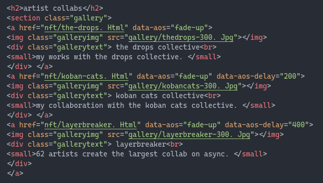
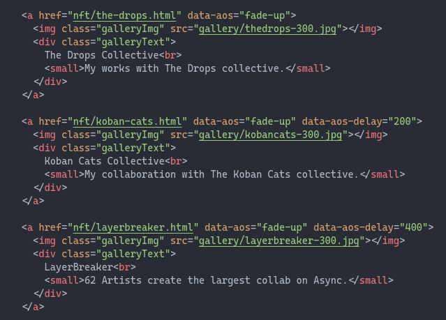
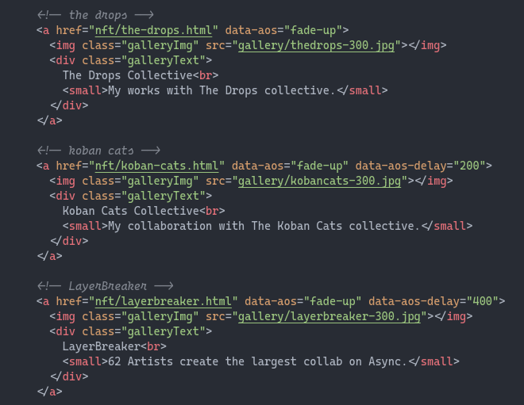

# Tabs

> Met tabs kan je je code duidelijker over **overzichtelijker** maken.
> 

**Zonder tabs:**

{: .frame }

**Met tabs:**

{: .frame }

# Comments

> Comments zijn stukjes tekst die je in je code kunt plaatsen om **uitleg of notities** toe te voegen. Deze opmerkingen worden **genegeerd door de computer**.  
Comments helpen je code beter te begrijpen en sneller een deel van je code terug te vinden.
> 

**Zonder comments:**

{: .frame }

**Met comments:**

{: .frame }

# Opdracht: Tabs en comments

1. Maak een screenshot van je vorige website.
2. Verbeter de code van je website door tabs en comments toe te voegen, neem opnieuwe een screenshot van je code.
