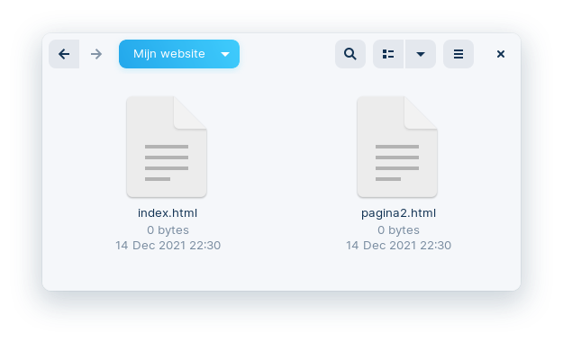

# Link naar een andere website

Zo maak je een link naar een andere website:

```html
Een link naar de <a href="https://www.w3schools.com">website van W3Schools</a> maak je zo.
```

# Link naar je eigen website

1. Om een link naar je eigen website te maken maak je eerst een nieuwe pagina, een HTML-bestand dus.
    In dit voorbeeld is **pagina2.html** de nieuwe pagina, de **naam** van deze pagina mag je **zelf kiezen**.
    
2. Om een link naar deze pagina te maken gebruik je terug de `<a>`-tag, maar in plaats van te verwijzen naar een website, verwijs je naar de nieuwe pagina:

```html
Een link naar <a href="pagina2.html">je eigen website<a> maak je zo.
```

3. De **startpagina** van je website moet je altijd de naam **index.html** geven, zo weet je browser welke pagina hij eerst moet openen.
De bestandsnamen van de **andere pagina’s** mag je **zelf kiezen**. 

# Link binnen de pagina

Je kan ook een link maken die naar een deel van je pagina scrolt als je erop klikt.

1. Geef het deel waar je naar wil scrollen een `id`:

```html
<p id="link1">text</p>
```

2. Link naar het element met dat `id`:

```html
<a href="#link1">link<a>
```

# Link een specifiek deel van een andere pagina

Je kan ook een link maken die naar een deel van een andere pagina scrolt als je erop klikt.

1. Geef het deel op de andere pagina waar je naar wil scrollen een `id`:

```html
<p id="link1">text</p>
```

2. Link naar het element met dat `id`:

```html
<a href="pagina2.html#link1">link<a>
```
